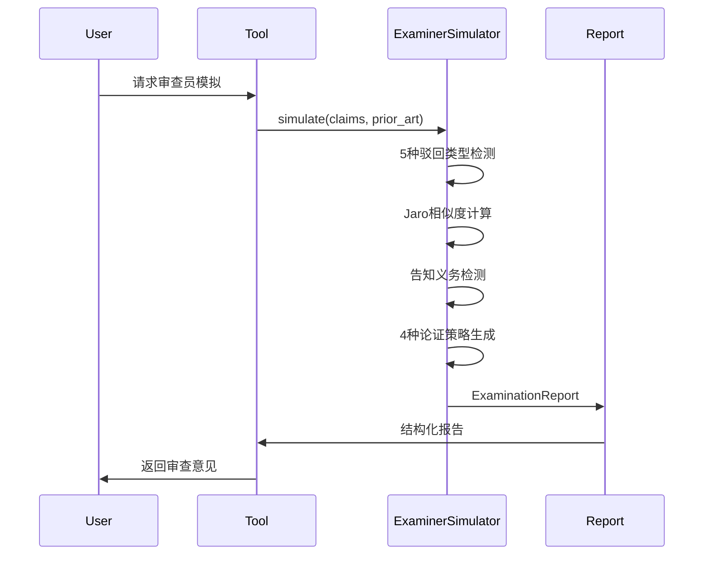
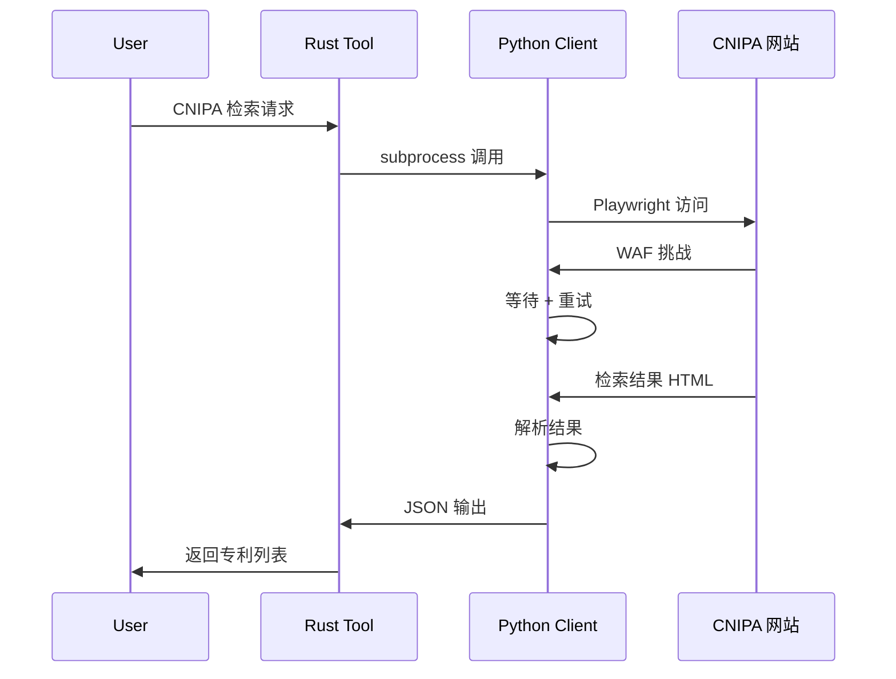
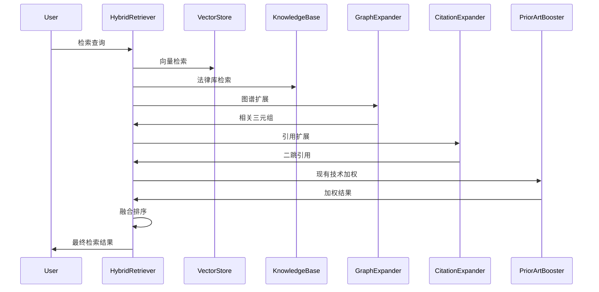
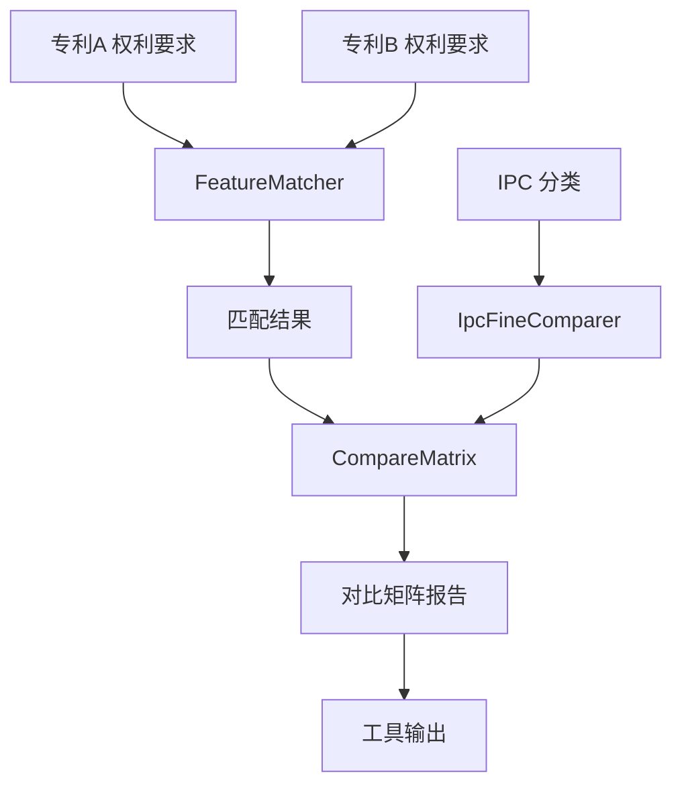
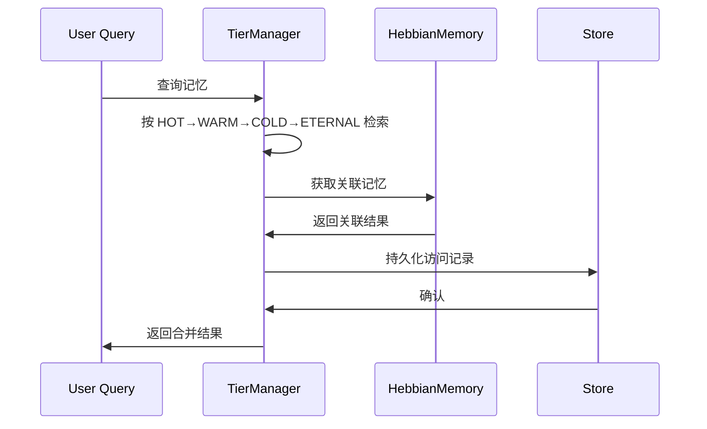
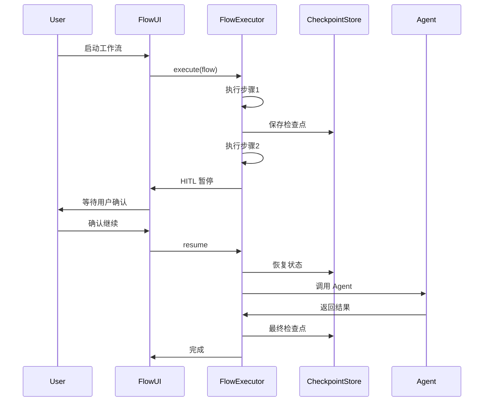
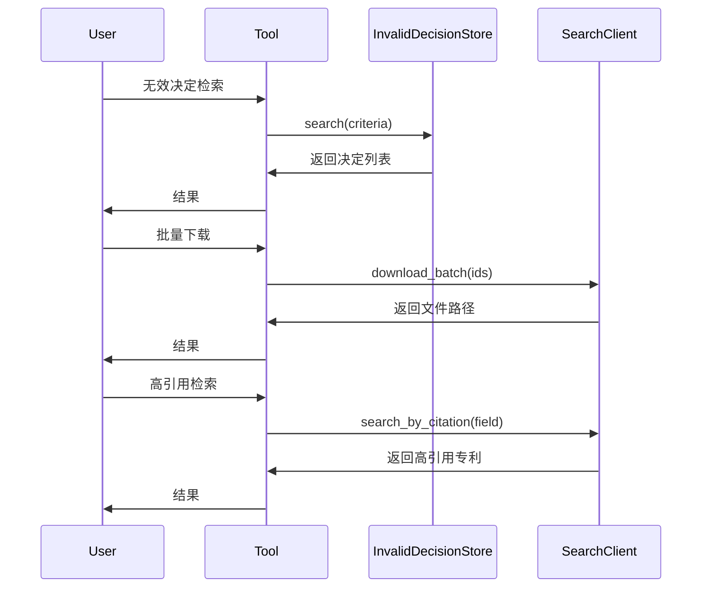
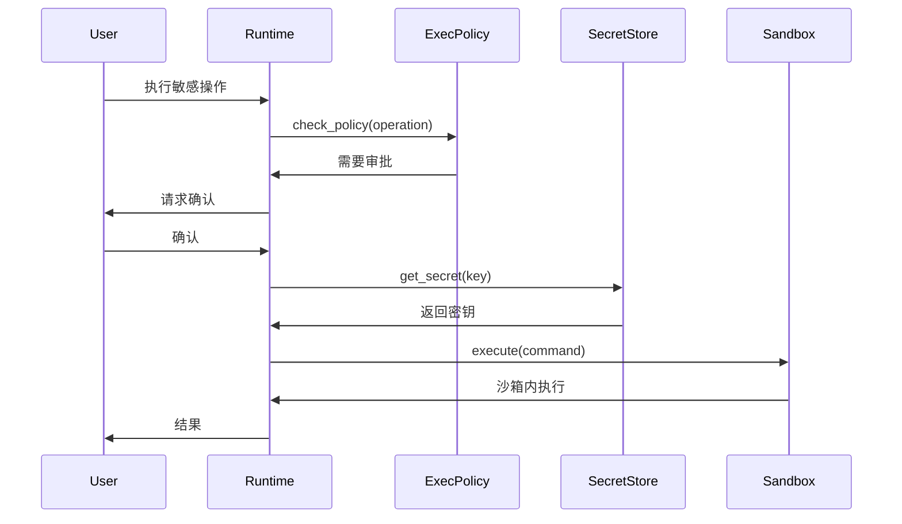
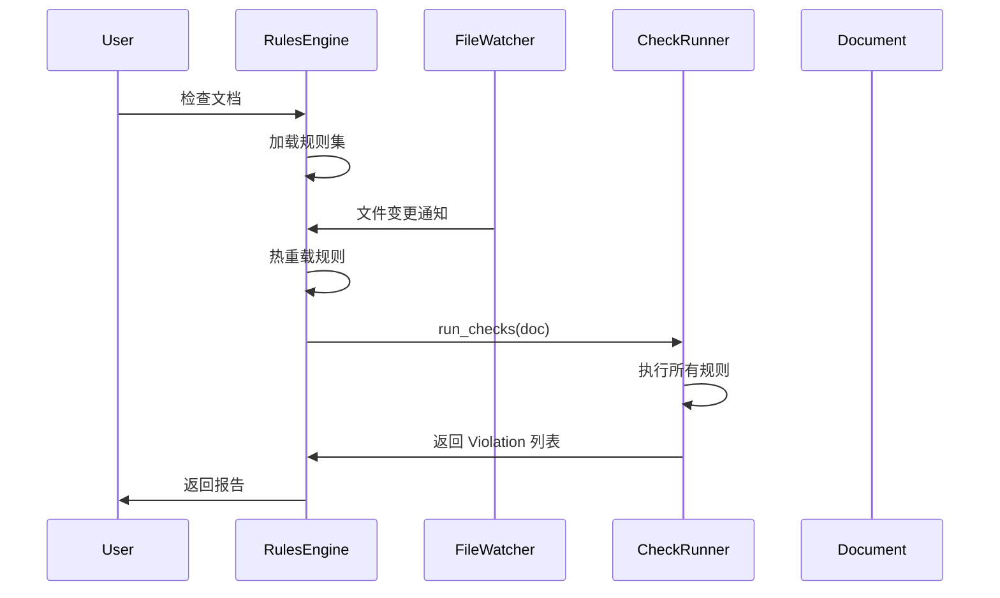
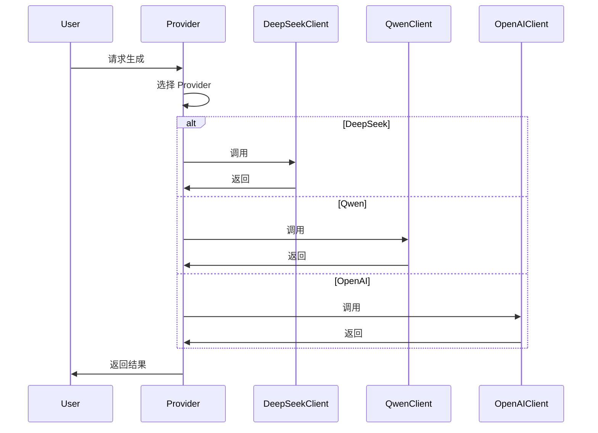

# Implementation Phases: YunXi 资产引入计划

**项目类型**: 知识产权智能体系统功能增强
**目标**: 从 yunpat-agent 引入核心缺口资产，补齐专利、法律、商标领域能力
**原则**: 去重优化、数据主权不引入、适配 YunXi 架构
**预计总时长**: 32 小时 (~32 分钟 人类审核时间)

---

## Phase 1: 审查员模拟器 (Examiner Simulator)
**类型**: Integration
**预计**: 3 小时
**文件**: 
- `rust/crates/patent-domain/src/examiner_simulator.rs` (新建, ~300 行)
- `rust/crates/tools/src/patent_analysis/examiner.rs` (新建, ~200 行)
- `rust/crates/patent-domain/src/models.rs` (修改, +50 行)

### File Map

- `rust/crates/patent-domain/src/examiner_simulator.rs` (新建, ~300 行)
  - **Purpose**: 审查员模拟器核心引擎
  - **Key exports**: `ExaminerSimulator`, `RejectionType`, `ArgumentStrategy`, `ExaminationReport`
  - **Dependencies**: patent-domain models, Jaro 相似度算法
  - **Used by**: tools patent_analysis

- `rust/crates/tools/src/patent_analysis/examiner.rs` (新建, ~200 行)
  - **Purpose**: 审查员模拟器工具包装
  - **Key exports**: `examiner_simulate` 函数
  - **Dependencies**: patent-domain examiner_simulator
  - **Used by**: tools dispatch

- `rust/crates/patent-domain/src/models.rs` (修改, +50 行)
  - **Purpose**: 添加审查员相关类型
  - **Modifications**: 添加 RejectionType, ArgumentStrategy 枚举

### Data Flow



### Critical Dependencies

**Internal**: patent-domain models
**External**: strsim (Jaro 相似度)
**Configuration**: None

### Gotchas & Known Issues

- **Jaro 相似度阈值**: 特征相似度 >0.85 视为等同，需可调参数
- **告知义务检测**: 需要维护关键词列表，可能误检
- **策略生成**: 纯规则引擎，不涉及 LLM，保持零依赖

### Tasks

- [ ] 在 patent-domain 添加 ExaminerSimulator 核心类型
- [ ] 实现 5 种驳回类型检测逻辑
- [ ] 实现 Jaro 相似度特征匹配
- [ ] 实现告知义务检测
- [ ] 实现 4 种论证策略生成
- [ ] 创建 tools 工具包装
- [ ] 注册到 tools dispatch
- [ ] 添加单元测试

### Verification Criteria

- [ ] 单元测试：5 种驳回类型正确识别
- [ ] 单元测试：Jaro 相似度计算准确
- [ ] 单元测试：告知义务检测覆盖主要场景
- [ ] 集成测试：工具调用返回完整 ExaminationReport

### Exit Criteria

审查员模拟器可以正确识别驳回类型、检测告知义务、生成论证策略，输出结构化报告。

---

## Phase 2: CNIPA 国知局爬虫与检索工具
**类型**: Integration
**预计**: 4 小时
**文件**:
- `python/tools/cnipa/cnipa_client.py` (新建, ~400 行)
- `python/tools/cnipa/cnipa_search.py` (新建, ~200 行)
- `python/tools/cnipa/cnipa_parser.py` (新建, ~150 行)
- `rust/crates/tools/src/patent_search/cnipa.rs` (新建, ~250 行)
- `rust/crates/tools/src/patent_search/mod.rs` (修改, +30 行)

### File Map

- `python/tools/cnipa/cnipa_client.py` (新建, ~400 行)
  - **Purpose**: Playwright WAF bypass + requests 复用客户端
  - **Key exports**: `CnipaClient`, `search`, `detail`, `download_pdf`
  - **Dependencies**: playwright, requests, Pillow
  - **Used by**: cnipa_search, cnipa_parser

- `python/tools/cnipa/cnipa_search.py` (新建, ~200 行)
  - **Purpose**: 检索接口封装
  - **Key exports**: `CnipaSearch`
  - **Used by**: Rust tools via PyO3 或 subprocess

- `python/tools/cnipa/cnipa_parser.py` (新建, ~150 行)
  - **Purpose**: HTML 解析器
  - **Key exports**: `parse_search_results`
  - **Used by**: cnipa_search

- `rust/crates/tools/src/patent_search/cnipa.rs` (新建, ~250 行)
  - **Purpose**: Rust 侧 CNIPA 工具封装
  - **Key exports**: `CnipaSearchTool`
  - **Dependencies**: subprocess 调用 Python 脚本
  - **Used by**: tools dispatch

### Data Flow



### Critical Dependencies

**Internal**: tools patent_search
**External**: Python 3.10+, playwright, requests, Pillow
**Configuration**: CNIPA 访问环境变量

### Gotchas & Known Issues

- **WAF 绕过**: Playwright 需要处理 Cloudflare 等 WAF，可能需要 headless 模式
- **Cookie 复用**: 首次 Playwright 获取 cookie 后，后续用 requests 复用
- **PDF 组装**: CNIPA 返回逐页 JPEG，需要组装为 PDF
- **超时处理**: 180s 超时，需配置重试策略

### Tasks

- [ ] 复制并适配 cnipa_epub_client.py
- [ ] 复制并适配 cnipa_epub_search.py
- [ ] 复制并适配 cnipa_epub_parse.py
- [ ] 创建 Rust 侧封装层
- [ ] 处理 WAF 绕过逻辑
- [ ] 实现 Cookie 复用机制
- [ ] 添加错误处理和重试
- [ ] 注册到 tools dispatch

### Verification Criteria

- [ ] 集成测试：CNIPA 检索返回有效结果
- [ ] 集成测试：WAF 绕过成功
- [ ] 集成测试：PDF 下载完整
- [ ] 错误测试：超时和重试正常工作

### Exit Criteria

CNIPA 检索工具可以绕过 WAF、执行检索、解析结果、下载 PDF，集成到现有工具链。

---

## Phase 3: 混合检索与 GraphRAG 增强
**类型**: Integration
**预计**: 4 小时
**文件**:
- `rust/crates/patent-domain/src/retrieval/hybrid.rs` (新建, ~300 行)
- `rust/crates/patent-domain/src/retrieval/graph_expand.rs` (新建, ~200 行)
- `rust/crates/patent-domain/src/retrieval/citation_expand.rs` (新建, ~150 行)
- `rust/crates/patent-domain/src/retrieval/prior_art_boost.rs` (新建, ~100 行)
- `rust/crates/patent-domain/src/retrieval/mod.rs` (新建, ~50 行)

### File Map

- `rust/crates/patent-domain/src/retrieval/hybrid.rs` (新建, ~300 行)
  - **Purpose**: 向量 + 法律库 + 图谱混合检索
  - **Key exports**: `HybridRetriever`, `FusionStrategy`
  - **Dependencies**: embedding, knowledge, sqlite_graph
  - **Used by**: tools patent_search

- `rust/crates/patent-domain/src/retrieval/graph_expand.rs` (新建, ~200 行)
  - **Purpose**: 法律图谱三元组扩展
  - **Key exports**: `GraphExpander`
  - **Dependencies**: sqlite_graph
  - **Used by**: hybrid

- `rust/crates/patent-domain/src/retrieval/citation_expand.rs` (新建, ~150 行)
  - **Purpose**: 二跳引用扩展
  - **Key exports**: `CitationExpander`
  - **Dependencies**: patent records
  - **Used by**: hybrid

- `rust/crates/patent-domain/src/retrieval/prior_art_boost.rs` (新建, ~100 行)
  - **Purpose**: 现有技术加权
  - **Key exports**: `PriorArtBooster`
  - **Dependencies**: citation data
  - **Used by**: hybrid

### Data Flow



### Critical Dependencies

**Internal**: embedding, knowledge, sqlite_graph
**External**: None (纯 Rust)
**Configuration**: None

### Gotchas & Known Issues

- **融合权重**: 向量/图谱/法律库的权重需要调参
- **性能**: 二跳引用可能产生大量结果，需要限制
- **图谱质量**: GraphRAG 效果依赖图谱数据质量

### Tasks

- [ ] 实现 HybridRetriever 核心融合逻辑
- [ ] 实现 GraphExpander 三元组扩展
- [ ] 实现 CitationExpander 二跳引用
- [ ] 实现 PriorArtBooster 加权
- [ ] 配置融合策略参数
- [ ] 添加单元测试
- [ ] 集成到现有检索工具

### Verification Criteria

- [ ] 单元测试：混合检索返回有效结果
- [ ] 单元测试：图谱扩展正确
- [ ] 单元测试：引用扩展限制有效
- [ ] 性能测试：检索延迟 < 2s

### Exit Criteria

混合检索引擎融合向量、图谱、法律库结果，支持引用扩展和现有技术加权。

---

## Phase 4: 专利对比矩阵与特征匹配
**类型**: Integration
**预计**: 3 小时
**文件**:
- `rust/crates/patent-domain/src/compare/matrix.rs` (新建, ~250 行)
- `rust/crates/patent-domain/src/compare/feature_match.rs` (新建, ~200 行)
- `rust/crates/patent-domain/src/compare/ipc_fine.rs` (新建, ~150 行)
- `rust/crates/patent-domain/src/compare/mod.rs` (新建, ~50 行)
- `rust/crates/tools/src/patent_analysis/compare_matrix.rs` (新建, ~200 行)

### File Map

- `rust/crates/patent-domain/src/compare/matrix.rs` (新建, ~250 行)
  - **Purpose**: 专利对比矩阵生成
  - **Key exports**: `CompareMatrix`, `ComparisonCell`
  - **Dependencies**: claim_parser, feature_match
  - **Used by**: tools compare

- `rust/crates/patent-domain/src/compare/feature_match.rs` (新建, ~200 行)
  - **Purpose**: 特征匹配算法
  - **Key exports**: `FeatureMatcher`, `MatchResult`
  - **Dependencies**: claim_parser
  - **Used by**: matrix

- `rust/crates/patent-domain/src/compare/ipc_fine.rs` (新建, ~150 行)
  - **Purpose**: IPC 精细对比
  - **Key exports**: `IpcFineComparer`
  - **Dependencies**: IPC 分类数据
  - **Used by**: matrix

- `rust/crates/tools/src/patent_analysis/compare_matrix.rs` (新建, ~200 行)
  - **Purpose**: 对比矩阵工具
  - **Key exports**: `patent_compare_matrix` 函数
  - **Dependencies**: patent-domain compare
  - **Used by**: tools dispatch

### Data Flow



### Critical Dependencies

**Internal**: claim_parser, patent-domain models
**External**: None
**Configuration**: None

### Gotchas & Known Issues

- **特征对齐**: 不同专利的特征表述可能不同，需要语义匹配
- **IPC 粒度**: 精细对比需要 IPC 层级数据
- **矩阵规模**: 大量权利要求时矩阵可能很大，需要分页

### Tasks

- [ ] 实现 FeatureMatcher 核心匹配逻辑
- [ ] 实现 CompareMatrix 矩阵生成
- [ ] 实现 IpcFineComparer 精细对比
- [ ] 创建工具包装层
- [ ] 注册到 tools dispatch
- [ ] 添加单元测试

### Verification Criteria

- [ ] 单元测试：特征匹配正确率 > 80%
- [ ] 单元测试：矩阵生成完整
- [ ] 单元测试：IPC 精细对比正确

### Exit Criteria

对比矩阵工具可以生成完整的专利对比矩阵，支持特征匹配和 IPC 精细对比。

---

## Phase 5: 记忆系统升级 (Hebbian + 4层记忆)
**类型**: Integration
**预计**: 3 小时
**文件**:
- `rust/crates/memory/src/hebbian.rs` (新建, ~250 行)
- `rust/crates/memory/src/tier.rs` (新建, ~200 行)
- `rust/crates/memory/src/types.rs` (修改, +100 行)
- `rust/crates/memory/src/store.rs` (修改, +150 行)

### File Map

- `rust/crates/memory/src/hebbian.rs` (新建, ~250 行)
  - **Purpose**: Hebbian 关联学习记忆
  - **Key exports**: `HebbianMemory`, `Association`
  - **Dependencies**: memory store
  - **Used by**: memory store

- `rust/crates/memory/src/tier.rs` (新建, ~200 行)
  - **Purpose**: 4 层记忆管理 (HOT/WARM/COLD/ETERNAL)
  - **Key exports**: `TierManager`, `MemoryTier`
  - **Dependencies**: memory store
  - **Used by**: memory store

- `rust/crates/memory/src/types.rs` (修改, +100 行)
  - **Purpose**: 添加 Hebbian 和 Tier 类型
  - **Modifications**: 添加 Association, MemoryTier 等类型

- `rust/crates/memory/src/store.rs` (修改, +150 行)
  - **Purpose**: 集成 Hebbian 和 Tier 管理
  - **Modifications**: 添加关联学习和层级迁移逻辑

### Data Flow



### Critical Dependencies

**Internal**: memory store
**External**: None
**Configuration**: None

### Gotchas & Known Issues

- **层级迁移**: 访问频率变化时需要在层级间迁移记忆
- **关联强度衰减**: Hebbian 关联需要衰减机制防止过度关联
- **存储膨胀**: ETERNAL 层可能无限增长，需要限制

### Tasks

- [ ] 实现 HebbianMemory 关联学习
- [ ] 实现 TierManager 4 层管理
- [ ] 修改 types 添加新类型
- [ ] 修改 store 集成新功能
- [ ] 实现层级迁移逻辑
- [ ] 实现关联衰减
- [ ] 添加单元测试

### Verification Criteria

- [ ] 单元测试：Hebbian 关联正确形成
- [ ] 单元测试：层级迁移正常工作
- [ ] 单元测试：关联衰减有效
- [ ] 性能测试：查询延迟 < 100ms

### Exit Criteria

记忆系统支持 Hebbian 关联学习和 4 层分级管理，可以智能迁移和衰减。

---

## Phase 6: 编排流引擎 (FlowEngine) 与 HITL
**类型**: Integration
**预计**: 4 小时
**文件**:
- `rust/crates/workflow/src/flow.rs` (新建, ~300 行)
- `rust/crates/workflow/src/executor.rs` (新建, ~400 行)
- `rust/crates/workflow/src/checkpoint.rs` (新建, ~200 行)
- `rust/crates/workflow/src/types.rs` (修改, +100 行)
- `rust/crates/yunxi-cli/src/flow_ui.rs` (新建, ~250 行)

### File Map

- `rust/crates/workflow/src/flow.rs` (新建, ~300 行)
  - **Purpose**: Flow 类型定义
  - **Key exports**: `Flow`, `FlowStep`, `AgentCall`, `QualityCheck`
  - **Dependencies**: None
  - **Used by**: executor

- `rust/crates/workflow/src/executor.rs` (新建, ~400 行)
  - **Purpose**: 流执行引擎
  - **Key exports**: `FlowExecutor`
  - **Dependencies**: flow, checkpoint
  - **Used by**: yunxi-cli

- `rust/crates/workflow/src/checkpoint.rs` (新建, ~200 行)
  - **Purpose**: 检查点持久化
  - **Key exports**: `Checkpoint`, `CheckpointStore`
  - **Dependencies**: SQLite
  - **Used by**: executor

- `rust/crates/yunxi-cli/src/flow_ui.rs` (新建, ~250 行)
  - **Purpose**: HITL 暂停/恢复 UI
  - **Key exports**: `FlowUI`
  - **Dependencies**: crossterm, ratatui
  - **Used by**: yunxi-cli

### Data Flow



### Critical Dependencies

**Internal**: workflow types, tools dispatch
**External**: SQLite (检查点)
**Configuration**: None

### Gotchas & Known Issues

- **检查点一致性**: 需要确保检查点原子性保存
- **HITL 超时**: 用户长时间不响应需要超时处理
- **并发安全**: 多个工作流并发执行需要隔离

### Tasks

- [ ] 实现 Flow 类型定义
- [ ] 实现 FlowExecutor 执行引擎
- [ ] 实现 CheckpointStore 检查点持久化
- [ ] 实现 HITL 暂停/恢复逻辑
- [ ] 创建 FlowUI 终端界面
- [ ] 集成到 yunxi-cli
- [ ] 添加单元测试

### Verification Criteria

- [ ] 单元测试：工作流执行完成
- [ ] 单元测试：检查点正确保存/恢复
- [ ] 单元测试：HITL 暂停/恢复正常工作
- [ ] 集成测试：完整工作流端到端测试

### Exit Criteria

编排流引擎支持多步骤工作流、检查点持久化、HITL 暂停/恢复，集成到 CLI 界面。

---

## Phase 7: 无效决定支持与更多 Native Tools
**类型**: Integration
**预计**: 3 小时
**文件**:
- `rust/crates/patent-domain/src/invalid_decision.rs` (新建, ~200 行)
- `rust/crates/tools/src/patent_analysis/invalid.rs` (新建, ~150 行)
- `rust/crates/tools/src/patent_search/batch_download.rs` (新建, ~200 行)
- `rust/crates/tools/src/patent_search/high_citation.rs` (新建, ~150 行)
- `rust/crates/tools/src/patent_search/mod.rs` (修改, +50 行)

### File Map

- `rust/crates/patent-domain/src/invalid_decision.rs` (新建, ~200 行)
  - **Purpose**: 无效决定类型和存储
  - **Key exports**: `InvalidDecision`, `InvalidDecisionStore`
  - **Dependencies**: SQLite
  - **Used by**: tools invalid

- `rust/crates/tools/src/patent_analysis/invalid.rs` (新建, ~150 行)
  - **Purpose**: 无效决定检索工具
  - **Key exports**: `invalid_decision_search`
  - **Dependencies**: patent-domain invalid_decision
  - **Used by**: tools dispatch

- `rust/crates/tools/src/patent_search/batch_download.rs` (新建, ~200 行)
  - **Purpose**: 批量专利下载
  - **Key exports**: `batch_patent_download`
  - **Dependencies**: patent search clients
  - **Used by**: tools dispatch

- `rust/crates/tools/src/patent_search/high_citation.rs` (新建, ~150 行)
  - **Purpose**: 高引用专利检索
  - **Key exports**: `high_citation_patents`
  - **Dependencies**: citation data
  - **Used by**: tools dispatch

### Data Flow



### Critical Dependencies

**Internal**: patent-domain, tools patent_search
**External**: None
**Configuration**: None

### Gotchas & Known Issues

- **无效决定数据源**: 需要接入数据源（如 wipo、cnipa）
- **批量下载限制**: 需要限制并发和总量防止被封
- **引用数据**: 高引用需要引用计数数据，可能不全

### Tasks

- [ ] 实现 InvalidDecision 类型和存储
- [ ] 实现无效决定检索工具
- [ ] 实现批量专利下载工具
- [ ] 实现高引用专利检索工具
- [ ] 注册到 tools dispatch
- [ ] 添加单元测试

### Verification Criteria

- [ ] 单元测试：无效决定存储 CRUD
- [ ] 单元测试：批量下载限制生效
- [ ] 单元测试：高引用排序正确

### Exit Criteria

新增 3 个工具：无效决定检索、批量下载、高引用检索，集成到现有工具链。

---

## Phase 8: 安全与企业功能
**类型**: Integration
**预计**: 3 小时
**文件**:
- `rust/crates/runtime/src/secrets.rs` (新建, ~200 行)
- `rust/crates/runtime/src/execpolicy.rs` (新建, ~250 行)
- `rust/crates/runtime/src/sandbox.rs` (新建, ~200 行)
- `rust/crates/runtime/src/hardening.rs` (新建, ~150 行)

### File Map

- `rust/crates/runtime/src/secrets.rs` (新建, ~200 行)
  - **Purpose**: OS keyring + 文件回退密钥存储
  - **Key exports**: `SecretStore`
  - **Dependencies**: keyring crate
  - **Used by**: runtime config

- `rust/crates/runtime/src/execpolicy.rs` (新建, ~250 行)
  - **Purpose**: 执行策略与审批模型
  - **Key exports**: `ExecPolicy`, `ApprovalManager`
  - **Dependencies**: YAML 解析
  - **Used by**: runtime permissions

- `rust/crates/runtime/src/sandbox.rs` (新建, ~200 行)
  - **Purpose**: 命令执行沙箱
  - **Key exports**: `Sandbox`
  - **Dependencies**: None
  - **Used by**: runtime bash

- `rust/crates/runtime/src/hardening.rs` (新建, ~150 行)
  - **Purpose**: 进程加固
  - **Key exports**: `Hardening`
  - **Dependencies**: nix (Linux), sandbox (macOS)
  - **Used by**: runtime init

### Data Flow



### Critical Dependencies

**Internal**: runtime config, permissions
**External**: keyring, yaml-rust
**Configuration**: execpolicy.yaml

### Gotchas & Known Issues

- **keyring 兼容性**: macOS/Windows/Linux 的 keyring 实现不同
- **沙箱限制**: 不同平台沙箱能力不同
- **策略热加载**: 文件变更时需要重新加载策略

### Tasks

- [ ] 实现 SecretStore OS keyring 集成
- [ ] 实现 ExecPolicy YAML 策略解析
- [ ] 实现 ApprovalManager 审批流程
- [ ] 实现 Sandbox 命令白名单
- [ ] 实现 Hardening 进程加固
- [ ] 集成到 runtime init
- [ ] 添加单元测试

### Verification Criteria

- [ ] 单元测试：密钥存储/读取
- [ ] 单元测试：策略匹配
- [ ] 单元测试：沙箱命令拦截
- [ ] 集成测试：完整审批流程

### Exit Criteria

安全模块提供密钥管理、执行策略、沙箱执行、进程加固能力。

---

## Phase 9: YAML 规则引擎与规则热加载
**类型**: Integration
**预计**: 3 小时
**文件**:
- `rust/crates/patent-domain/src/rules/engine.rs` (新建, ~300 行)
- `rust/crates/patent-domain/src/rules/checks.rs` (新建, ~250 行)
- `rust/crates/patent-domain/src/rules/schema.rs` (新建, ~150 行)
- `rust/crates/patent-domain/src/rules/mod.rs` (新建, ~50 行)
- `assets/rules/` (新建目录 + 示例规则文件)

### File Map

- `rust/crates/patent-domain/src/rules/engine.rs` (新建, ~300 行)
  - **Purpose**: YAML 规则引擎
  - **Key exports**: `RulesEngine`, `RuleSet`
  - **Dependencies**: yaml-rust, notify (热加载)
  - **Used by**: patent-domain, tools

- `rust/crates/patent-domain/src/rules/checks.rs` (新建, ~250 行)
  - **Purpose**: 规则检查实现
  - **Key exports**: `CheckRunner`
  - **Dependencies**: engine
  - **Used by**: engine

- `rust/crates/patent-domain/src/rules/schema.rs` (新建, ~150 行)
  - **Purpose**: 规则 schema 定义
  - **Key exports**: `Rule`, `Check`, `Violation`
  - **Dependencies**: None
  - **Used by**: engine, checks

- `assets/rules/patent_rules.yaml` (新建)
  - **Purpose**: 示例专利规则
  - **Content**: 格式完整性、引用链等规则

### Data Flow



### Critical Dependencies

**Internal**: patent-domain
**External**: yaml-rust, notify
**Configuration**: assets/rules/*.yaml

### Gotchas & Known Issues

- **规则冲突**: 多个规则可能产生冲突的 Violation
- **性能**: 大量规则检查可能影响性能
- **YAML 格式**: 需要严格的 schema 验证

### Tasks

- [ ] 实现 Rule schema 定义
- [ ] 实现 RulesEngine 核心
- [ ] 实现 CheckRunner
- [ ] 实现文件热加载
- [ ] 创建示例规则文件
- [ ] 集成到现有质量检查
- [ ] 添加单元测试

### Verification Criteria

- [ ] 单元测试：规则匹配正确
- [ ] 单元测试：热加载生效
- [ ] 单元测试：冲突处理正确

### Exit Criteria

YAML 规则引擎支持热加载、多规则检查、冲突处理，可以动态扩展规则。

---

## Phase 10: 多 Provider 模型接口升级
**类型**: Integration
**预计**: 2 小时
**文件**:
- `rust/crates/llm/src/providers/deepseek.rs` (新建, ~200 行)
- `rust/crates/llm/src/providers/qwen.rs` (新建, ~200 行)
- `rust/crates/llm/src/providers/mod.rs` (修改, +100 行)
- `rust/crates/llm/src/embeddings.rs` (新建, ~150 行)

### File Map

- `rust/crates/llm/src/providers/deepseek.rs` (新建, ~200 行)
  - **Purpose**: DeepSeek API 客户端
  - **Key exports**: `DeepSeekClient`
  - **Dependencies**: reqwest, api
  - **Used by**: llm provider

- `rust/crates/llm/src/providers/qwen.rs` (新建, ~200 行)
  - **Purpose**: Qwen API 客户端
  - **Key exports**: `QwenClient`
  - **Dependencies**: reqwest, api
  - **Used by**: llm provider

- `rust/crates/llm/src/embeddings.rs` (新建, ~150 行)
  - **Purpose**: BGE-M3 嵌入客户端
  - **Key exports**: `EmbeddingClient`
  - **Dependencies**: reqwest
  - **Used by**: embedding crate (可选)

### Data Flow



### Critical Dependencies

**Internal**: llm provider, api
**External**: reqwest
**Configuration**: API keys

### Gotchas & Known Issues

- **API 差异**: 不同 provider 的 API 格式不同
- **流式响应**: SSE 解析需要统一
- **错误处理**: 不同 provider 的错误码不同

### Tasks

- [ ] 实现 DeepSeekClient
- [ ] 实现 QwenClient
- [ ] 实现 EmbeddingClient
- [ ] 统一 Provider 接口
- [ ] 添加单元测试

### Verification Criteria

- [ ] 单元测试：各 Provider 请求正确
- [ ] 单元测试：流式响应解析正确
- [ ] 单元测试：错误处理正确

### Exit Criteria

LLM 模块支持 DeepSeek、Qwen、OpenAI 多 Provider，统一接口。

---

## 去重与优化说明

### 已去重的资产（YunXi 已有，不引入）

| yunpat-agent 资产 | YunXi 现有等效资产 | 决策 |
|---|---|---|
| 权利要求解析器 | `patent-domain/src/claim_parser.rs` | **去重**，YunXi 已有完整实现 |
| 法律推理引擎 | `patent-domain/src/legal_reasoning.rs` | **去重**，YunXi 已有三步法+问题-解决方案法 |
| 规则推理引擎 | `patent-domain/src/rule_engine.rs` | **优化**，已有 6 条规则，但缺少 YAML 热加载（Phase 9 补充） |
| OA 答复模板 | `tools/src/patent_oa/builtin_templates.json` | **去重**，YunXi 已有 6 个模板 |
| 专利质量评分 | `tools/src/patent_quality/` | **去重**，YunXi 已有 12 条规则+四维评分 |
| 专利形式检查 | `tools/src/patent_formality/` | **去重**，YunXi 已有完整实现 |
| 专利检索 | `tools/src/patent_search/` | **优化**，已有基础检索，缺少 CNIPA（Phase 2 补充） |
| 商标分析 | `tools/src/patent_management/trademark.rs` | **去重**，YunXi 已有完整实现 |
| 语义对比 | `tools/src/patent_analysis/compare.rs` | **去重**，YunXi 已有 4 模式对比 |
| 生命周期管理 | `tools/src/patent_management/lifecycle.rs` | **去重**，YunXi 已有状态机 |
| 知识图谱 | `patent-domain/src/sqlite_graph.rs` | **去重**，YunXi 已有 SQLite 图谱 |
| 向量嵌入 | `embedding/src/` | **去重**，YunXi 已有 BGE-M3 ONNX |
| 意图分类 | `intent/src/` | **去重**，YunXi 已有分类器 |
| 工作流调度 | `workflow/src/scheduler.rs` | **优化**，已有基础调度，缺少 HITL（Phase 6 补充） |
| 推理管线 | `reasoning/src/` | **去重**，YunXi 已有 hypothesis+pipeline |
| IM 适配器 | `adapters/src/` | **去重**，YunXi 已有 4 平台适配 |
| 法律数据库 | `knowledge/src/law_db.rs` | **去重**，YunXi 已有 SQLite FTS5 |

### 优化引入的资产

| 资产 | 优化方式 |
|---|---|
| 规则引擎 | 保留现有 QualitativeRuleEngine，新增 YAML 热加载层（Phase 9） |
| 专利检索 | 保留现有 Google Patents 检索，新增 CNIPA 源（Phase 2） |
| 工作流 | 保留现有 scheduler，新增 FlowEngine HITL 层（Phase 6） |
| 记忆系统 | 保留现有 store，新增 Hebbian+Tier 层（Phase 5） |
| LLM 接口 | 保留现有 OpenAI，新增 DeepSeek/Qwen（Phase 10） |

---

## 引入资产总览

### 高优先级（核心技术缺口）
1. ✅ 审查员模拟器 (Phase 1)
2. ✅ CNIPA 国知局爬虫 (Phase 2)
3. ✅ 混合检索/GraphRAG (Phase 3)
4. ✅ 专利对比矩阵 (Phase 4)
5. ✅ 记忆系统升级 (Phase 5)
6. ✅ 编排流引擎 HITL (Phase 6)

### 中优先级（功能增强）
7. ✅ 无效决定支持 (Phase 7)
8. ✅ 安全/企业功能 (Phase 8)
9. ✅ YAML 规则引擎 (Phase 9)

### 低优先级（可选优化）
10. ✅ 多 Provider 模型 (Phase 10)

---

## 依赖关系图

```
Phase 1 (审查员模拟器)
  └─→ 独立

Phase 2 (CNIPA 爬虫)
  └─→ 依赖: 现有 patent_search

Phase 3 (混合检索)
  ├─→ 依赖: embedding
  ├─→ 依赖: knowledge
  └─→ 依赖: sqlite_graph

Phase 4 (对比矩阵)
  └─→ 依赖: claim_parser

Phase 5 (记忆升级)
  └─→ 依赖: 现有 memory

Phase 6 (编排引擎)
  ├─→ 依赖: workflow
  └─→ 依赖: checkpoint (SQLite)

Phase 7 (无效决定)
  ├─→ 依赖: patent-domain
  └─→ 依赖: patent_search

Phase 8 (安全功能)
  └─→ 依赖: runtime

Phase 9 (规则引擎)
  └─→ 依赖: patent-domain

Phase 10 (多 Provider)
  └─→ 依赖: llm
```

**建议执行顺序**: 1 → 5 → 8 → 9 → 10 → 4 → 3 → 7 → 2 → 6

（先完成独立模块，再完成依赖模块，最后完成编排引擎）

---

## 测试策略

- **单元测试**: 每个 Phase 包含独立测试
- **集成测试**: Phase 6 完成后进行端到端工作流测试
- **兼容性测试**: 确保引入资产不影响现有功能
- **性能测试**: Phase 3 和 Phase 5 需要性能基准

---

## 风险评估

| 风险 | 影响 | 缓解措施 |
|---|---|---|
| CNIPA WAF 绕过失效 | 高 | 保持 Playwright 策略更新，准备备用方案 |
| 记忆系统数据迁移 | 中 | 提供迁移脚本，保持向后兼容 |
| 规则引擎与现有冲突 | 中 | 渐进式引入，保留原有引擎 |
| 多 Provider API 变更 | 低 | 抽象接口隔离，快速适配 |

---

## 下一步

1. 审核此计划
2. 确认 Phase 执行顺序
3. 创建 SESSION.md 跟踪进度
4. 开始 Phase 1 实施
