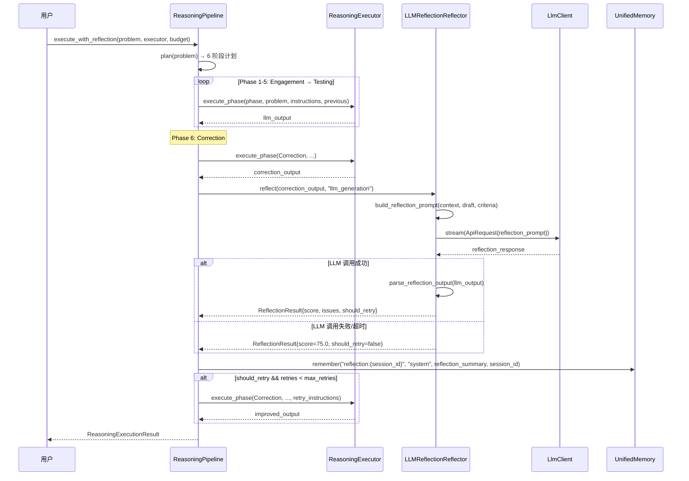
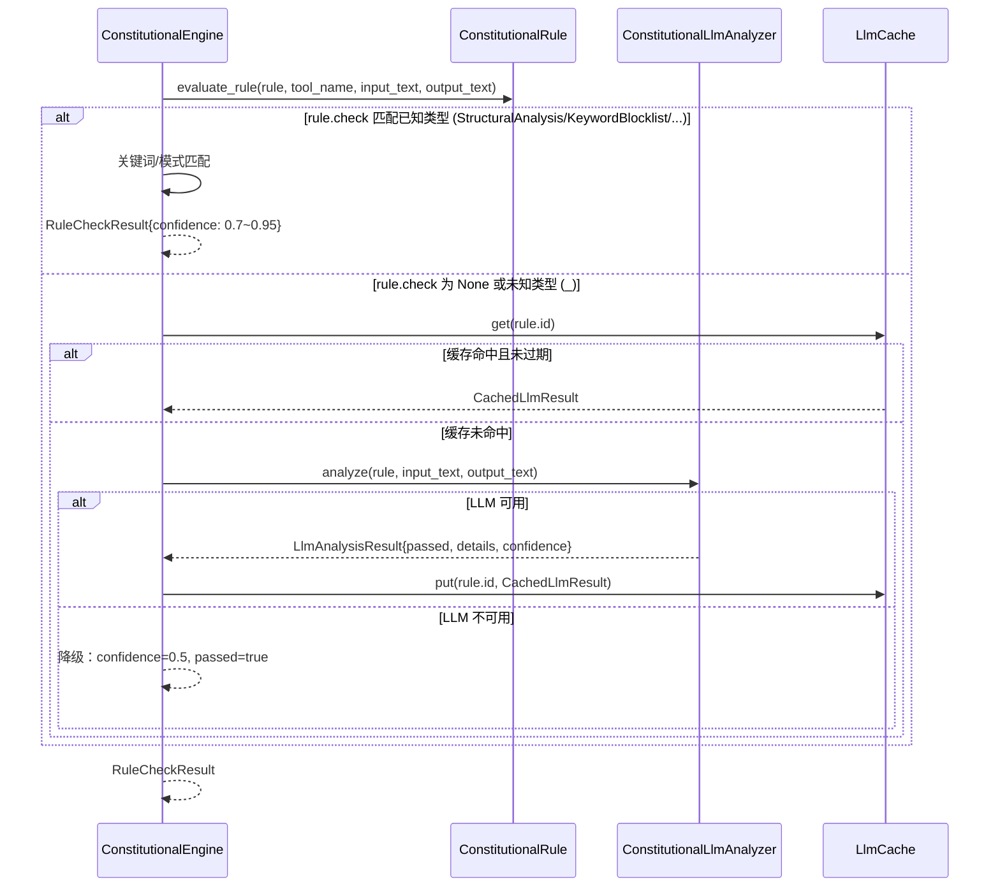
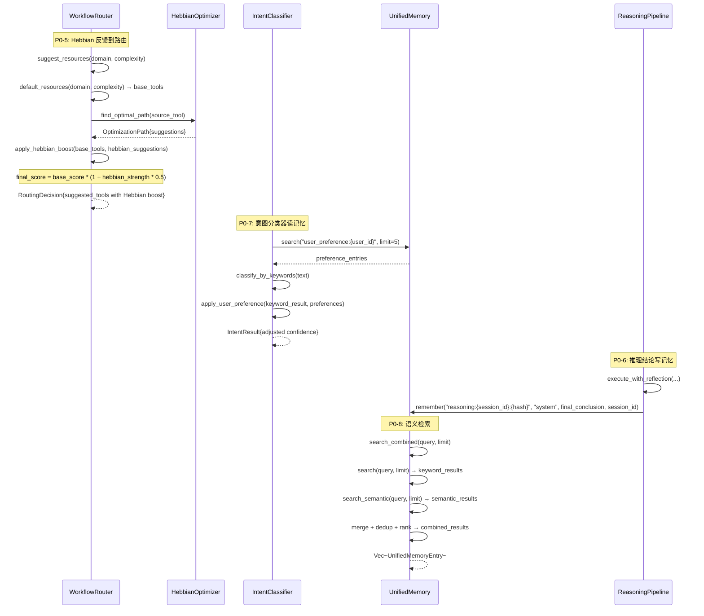
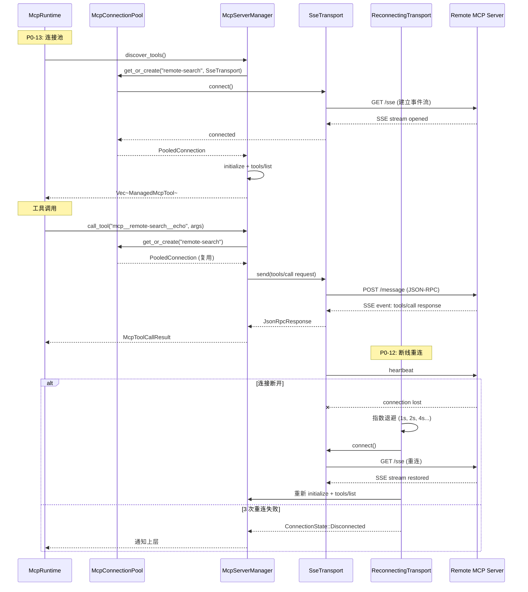
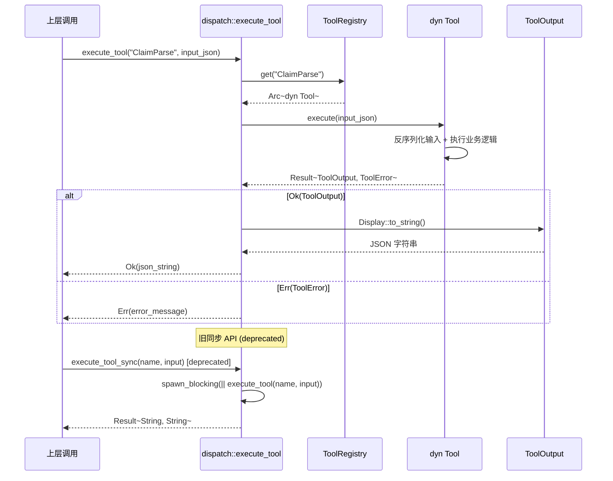
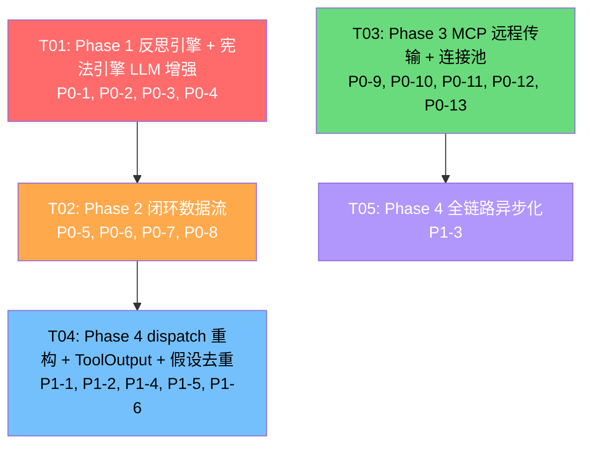

# YunXi Phase 1-4 优化计划 — 系统架构设计

> 文档版本：v1.0
> 日期：2026-06-04
> 作者：架构师 Bob
> 项目：YunXi 专业专利 AI Agent
> PRD 版本：v1.0

---

## 1. 实现方案

### 1.1 Phase 1：反思引擎（P0-1 ~ P0-4）

**核心挑战**：
- `LLMReflectionReflector` 是 STUB，需要注入 `LlmClient` 调用真实 LLM
- `ReasoningPipeline::execute()` 的 Correction 阶段无反思调用
- 宪法引擎 `_` 分支返回 `confidence=0.5` 硬编码
- 评估结果与记忆系统无数据流

**实现方案**：

#### P0-1：LLM 反思器实现
- **策略**：在 `LLMReflectionReflector` 中注入 `LlmClient` 引用（通过 `Arc<Mutex<LlmClient>>`），替换 STUB 硬编码
- **模型选择**：使用独立轻量模型（如 `claude-sonnet-4-6` 或 `gemini-2.0-flash`），通过 `ReflectionConfig` 新增 `reflection_model` 字段配置
- **降级策略**：LLM 调用失败时返回默认 `ReflectionResult`（score=75.0, should_retry=false），保证系统不崩溃
- **超时控制**：复用 `ReflectionConfig::reflection_timeout_ms`（默认 5000ms）

#### P0-2：反思集成到 Correction 阶段
- **策略**：在 `ReasoningPipeline::execute()` 中增加 `Reflector` 依赖注入
- **实现**：新增 `ReasoningPipeline::execute_with_reflection()` 方法，在 Correction 阶段调用 `Reflector::reflect()`
- **重试逻辑**：当 `should_retry=true` 且重试次数 < `max_retries` 时，重新执行低分阶段
- **兼容性**：保留 `execute()` 原签名不变，新方法为扩展

#### P0-3：宪法引擎 LLM 增强
- **策略**：在 `ConstitutionalEngine` 中注入可选的 `ConstitutionalLlmAnalyzer` trait 对象
- **调用条件**：仅对 `_` 分支（无法识别的检查类型）和 `confidence < 0.6` 的结果调用 LLM
- **缓存**：使用 `HashMap<String, CachedLlmResult>` 内存缓存，TTL=1h，避免重复调用
- **降级**：LLM 不可用时保持当前关键词匹配逻辑

#### P0-4：评估结果闭环
- **策略**：在 `LLMReflectionReflector::reflect()` 返回后，调用 `UnifiedMemory::remember()` 写入评估结果
- **数据格式**：记忆内容包含评估分数、改进建议、策略调整建议，key 格式为 `reflection:{session_id}:{timestamp}`
- **依赖注入**：`LLMReflectionReflector` 新增 `memory: Option<Arc<UnifiedMemory>>` 字段

### 1.2 Phase 2：感知→学习→记忆→推理闭环（P0-5 ~ P0-8）

**核心挑战**：
- `WorkflowRouter` 无 memory 依赖，不读 Hebbian
- `ReasoningPipeline` 完成后不写 UnifiedMemory
- `IntentClassifier` 无 memory 依赖
- `UnifiedMemory::search()` 仅文件+关键词，无语义搜索

**实现方案**：

#### P0-5：Hebbian 学习反馈到 WorkflowRouter
- **策略**：在 `WorkflowRouter` 中注入 `HebbianOptimizer` 引用
- **权重融合**：乘性增强公式 `final_score = base_score * (1 + hebbian_strength * 0.5)`
- **实现**：在 `suggest_resources()` 中，获取基础推荐后调用 `HebbianOptimizer::find_optimal_path()` 获取 Hebbian 建议，按权重排序插入 `suggested_tools`

#### P0-6：推理结论写入 UnifiedMemory
- **策略**：在 `ReasoningPipeline` 中注入 `UnifiedMemory` 引用
- **实现**：`execute_with_reflection()` 完成后，将 `final_conclusion` + 推理过程摘要写入 `UnifiedMemory::remember()`
- **key 格式**：`reasoning:{session_id}:{problem_hash}`

#### P0-7：意图分类器集成记忆系统
- **策略**：在 `IntentClassifier` 中注入 `UnifiedMemory` 引用
- **实现**：`classify()` 执行前先从 `UnifiedMemory::search()` 读取用户偏好，偏好作为置信度调整因子
- **偏好来源**：从用户修正行为中自动提取（如用户选择了分类器未首推的意图）

#### P0-8：记忆语义检索
- **策略**：复用现有 BGE-M3 embedding，在 `UnifiedMemory::search()` 中增加向量搜索路径
- **实现**：新增 `UnifiedMemory::search_semantic()` 方法，调用 `embedding::shared_optional()` 获取 embedding 服务
- **合并策略**：语义搜索与关键词搜索结果合并、去重，按综合相关度排序
- **新增字段**：`UnifiedMemory` 增加 `vector_store: Option<VectorStore>` 字段

### 1.3 Phase 3：MCP 远程传输（P0-9 ~ P0-13）

**核心挑战**：
- `McpServerManager` 仅支持 Stdio，SSE/HTTP/WS 被标记为 unsupported
- `McpRuntime` 每次 `call_tool()` 创建新 `tokio::Runtime`
- 无断线重连机制

**实现方案**：

#### P0-9~11：SSE/HTTP/WS 传输层
- **策略**：基于 `rmcp` crate 的传输 trait 定义扩展，实现三种远程传输
- **SSE 传输**：`SseTransport`，使用 `reqwest` + `eventsource-stream` 解析 SSE 事件流
- **HTTP 传输**：`HttpTransport`，JSON-RPC over HTTP POST，使用 `reqwest`
- **WS 传输**：`WsTransport`，双向 JSON-RPC over WebSocket，使用 `tokio-tungstenite`
- **统一抽象**：定义 `McpTransportConnection` trait，三种传输实现该 trait
- **集成**：修改 `McpServerManager::from_servers()` 不再将非 Stdio 标记为 unsupported

#### P0-12：断线重连机制
- **策略**：实现 `ReconnectingTransport` 装饰器，包装任何 `McpTransportConnection`
- **重连策略**：指数退避（1s, 2s, 4s, 8s, 16s, 30s, 30s, ...），最大间隔 30s
- **重连后恢复**：重新执行 `initialize` + `tools/list` 恢复工具发现状态
- **失败处理**：连续 3 次重连失败后标记 `disconnected` 并通知上层

#### P0-13：连接池优化
- **策略**：`McpRuntime` 复用全局 `tokio::Runtime`，消除每次 `call_tool()` 创建 Runtime 的问题
- **实现**：`McpRuntime::new()` 接受外部 `tokio::runtime::Handle`，或使用 `OnceLock<Runtime>` 全局单例
- **连接池**：为每个 MCP 服务器维护一个连接状态，idle 超时 5min 后回收

### 1.4 Phase 4：P1 质量改善（P1-1 ~ P1-6）

**核心挑战**：
- `active_intents()` 仅 12/50 种意图
- `dispatch.rs` 是 40+ 分支 match
- 多处使用 `block_on()`
- 专利工具输出格式不统一
- 假设去重用精确字符串匹配
- 宪法引擎无 LLM 增强（与 P0-3 合并/复用）

**实现方案**：

#### P1-1：active_intents 扩展
- **策略**：改为配置驱动，从 YAML/JSON 配置文件加载活跃意图列表，默认全量 50 种
- **实现**：`IntentClassifier::new()` 从配置文件或默认常量加载 `active_intents`，`classify_by_embedding()` 的标签列表同步扩展

#### P1-2：dispatch 重构为 trait-based registry
- **策略**：定义 `Tool` trait，使用 `inventory` crate 编译期注册
- **实现**：每个工具模块实现 `Tool` trait 并使用 `inventory::submit!` 注册，`dispatch.rs` 的 match 替换为 registry 查表
- **过渡期**：保留 `execute_tool()` 函数签名不变，内部从 registry 查找

#### P1-3：全链路异步化
- **策略**：工具执行接口改为 `async fn execute()`，消除 `block_on()`
- **过渡层**：提供 `spawn_blocking` 桥接层，标记 `#[deprecated]`
- **重点文件**：`tools/lib.rs`、`mcp-bridge/src/lib.rs`、`llm/src/lib.rs`

#### P1-4：ToolOutput 统一
- **策略**：定义 `ToolOutput` struct，所有工具统一返回 `Result<ToolOutput, ToolError>`
- **兼容**：`ToolOutput` 实现 `Display` trait（输出 JSON 字符串），上层代码可渐进迁移
- **实现**：先修改 `dispatch.rs` 返回类型，再逐个工具迁移

#### P1-5：假设去重 embedding
- **策略**：`HypothesisManager::is_duplicate()` 改用 embedding 余弦相似度判断
- **阈值**：默认 0.85，可配置，范围 [0.7, 0.95]
- **降级**：embedding 不可用时回退到精确字符串匹配
- **实现**：`HypothesisManager` 新增 `embedding_svc: Option<Arc<EmbeddingService>>` 字段

#### P1-6：宪法引擎 LLM 增强
- **复用 P0-3 实现**：P0-3 仅对 `_` 分支调用 LLM，P1-6 扩展到 `confidence < 0.6` 的所有结果

---

## 2. 文件列表

### 2.1 新建文件

| 相对路径 | 说明 | 估算行数 |
|---------|------|---------|
| `rust/crates/tools/src/reflection/reflection_llm_client.rs` | LLM 反思器 LLM 调用适配器 | ~120 |
| `rust/crates/constitutional-engine/src/llm_analyzer.rs` | 宪法引擎 LLM 分析 trait + 默认实现 | ~150 |
| `rust/crates/constitutional-engine/src/cache.rs` | LLM 分析结果缓存 | ~80 |
| `rust/crates/memory/src/semantic_search.rs` | 记忆语义搜索实现 | ~120 |
| `rust/crates/runtime/src/mcp_remote.rs` | MCP 远程传输统一 trait + SSE/HTTP/WS 实现 | ~400 |
| `rust/crates/runtime/src/mcp_reconnect.rs` | 断线重连装饰器 | ~150 |
| `rust/crates/runtime/src/mcp_pool.rs` | MCP 连接池管理 | ~120 |
| `rust/crates/tools/src/registry.rs` | Tool trait + inventory 注册 | ~100 |
| `rust/crates/tools/src/tool_output.rs` | ToolOutput/ToolError 定义 | ~60 |

### 2.2 修改文件

| 相对路径 | 修改说明 | 估算改动行数 |
|---------|---------|------------|
| `rust/crates/tools/src/reflection/llm_reflection.rs` | 注入 LlmClient，替换 STUB | ~80 |
| `rust/crates/tools/src/reflection/mod.rs` | 新增 memory 依赖，导出更新 | ~20 |
| `rust/crates/reasoning/src/pipeline.rs` | 增加 Reflector + UnifiedMemory 依赖，Correction 阶段反思 | ~100 |
| `rust/crates/reasoning/src/lib.rs` | 导出新增 pub 类型 | ~5 |
| `rust/crates/reasoning/src/hypothesis.rs` | 注入 EmbeddingService，is_duplicate 改用 embedding | ~60 |
| `rust/crates/constitutional-engine/src/engine.rs` | 注入 LlmAnalyzer，_ 分支和低 confidence 调用 LLM | ~80 |
| `rust/crates/constitutional-engine/src/lib.rs` | 导出新增模块 | ~5 |
| `rust/crates/constitutional-engine/Cargo.toml` | 新增 llm 依赖 | ~3 |
| `rust/crates/memory/src/unified.rs` | 新增 search_semantic()，注入 VectorStore | ~80 |
| `rust/crates/memory/src/lib.rs` | 导出新增模块 | ~5 |
| `rust/crates/router/src/workflow_router.rs` | 注入 HebbianOptimizer，suggest_resources 增加 Hebbian 增强 | ~60 |
| `rust/crates/router/Cargo.toml` | 新增 memory 依赖 | ~3 |
| `rust/crates/intent/src/classifier.rs` | 注入 UnifiedMemory，扩展 active_intents，偏好调整 | ~80 |
| `rust/crates/intent/src/lib.rs` | 导出更新 | ~5 |
| `rust/crates/intent/Cargo.toml` | 新增 memory 依赖 | ~3 |
| `rust/crates/runtime/src/mcp_stdio.rs` | 抽取 McpTransportConnection trait | ~40 |
| `rust/crates/runtime/src/mcp_client.rs` | 更新 ManagedMcpServer 支持远程传输 | ~40 |
| `rust/crates/runtime/src/lib.rs` | 导出新增模块 | ~5 |
| `rust/crates/runtime/Cargo.toml` | 新增 reqwest, tokio-tungstenite 等依赖 | ~8 |
| `rust/crates/mcp-bridge/src/lib.rs` | 复用全局 Runtime，消除 block_on | ~60 |
| `rust/crates/tools/src/dispatch.rs` | 替换为 registry 查表 | ~40 |
| `rust/crates/tools/src/lib.rs` | 新增 registry 模块，消除 block_on | ~30 |
| `rust/crates/tools/src/tool_output.rs` | 工具输出统一（各工具模块渐进迁移） | ~20 |
| `rust/crates/llm/src/lib.rs` | 提供异步 API，消除 block_on 嵌套风险 | ~40 |
| `rust/crates/reasoning/Cargo.toml` | 新增 memory, tools 依赖 | ~5 |

---

## 3. 数据结构和接口（类图）

```mermaid
classDiagram
    %% Phase 1: 反思引擎
    class LLMReflectionReflector {
        -config: ReflectionConfig
        -llm_client: Option~Arc~Mutex~LlmClient~~
        -memory: Option~Arc~UnifiedMemory~
        +new(config, llm_client, memory) LLMReflectionReflector
        +build_reflection_prompt(task, draft, criteria) String
        +parse_reflection_output(llm_output) Tuple
        -reflect_on_llm_output(draft, context) ReflectionResult
    }
    LLMReflectionReflector ..|> Reflector : implements

    class Reflector {
        <<trait>>
        +reflect(action_result: Value, action_type: str) Result~ReflectionResult, String~
        +should_retry(reflection, config) bool
    }

    class ReflectionConfig {
        +max_retries: usize
        +score_threshold: f64
        +enable_llm_reflection: bool
        +enable_action_review: bool
        +reflection_timeout_ms: u64
        +reflection_model: Option~String~
    }

    class ReflectionResult {
        +action_type: String
        +success: bool
        +score: f64
        +issues: Vec~ActionIssue~
        +improvement_suggestions: Vec~String~
        +should_retry: bool
        +retry_strategy: Option~String~
    }

    class ReasoningPipeline {
        -config: PipelineConfig
        -reflector: Option~Arc~dyn Reflector~~
        -memory: Option~Arc~UnifiedMemory~
        +new(config) ReasoningPipeline
        +with_reflector(reflector) ReasoningPipeline
        +with_memory(memory) ReasoningPipeline
        +plan(problem) Vec~ReasoningStepOutput~
        +execute(problem, executor, budget) ReasoningExecutionResult
        +execute_with_reflection(problem, executor, budget) ReasoningExecutionResult
    }

    class ConstitutionalEngine {
        -rules: HashMap~String, ConstitutionalRules~
        -llm_analyzer: Option~Arc~dyn ConstitutionalLlmAnalyzer~~
        -llm_cache: HashMap~String, CachedLlmResult~
        +new(rules) ConstitutionalEngine
        +with_llm_analyzer(analyzer) ConstitutionalEngine
        +check_all(tool_name, input_text, output_text, phase) Vec~RuleCheckResult~
        -evaluate_rule(rule, tool_name, input_text, output_text) RuleCheckResult
    }

    class ConstitutionalLlmAnalyzer {
        <<trait>>
        +analyze(rule: ConstitutionalRule, input_text: str, output_text: Option~str~) Result~LlmAnalysisResult, String~
    }

    class CachedLlmResult {
        +result: RuleCheckResult
        +cached_at: DateTime~Utc~
        +is_expired() bool
    }

    class LlmAnalysisResult {
        +passed: bool
        +details: Vec~String~
        +confidence: f64
    }

    ConstitutionalEngine --> ConstitutionalLlmAnalyzer : uses
    ConstitutionalEngine --> CachedLlmResult : caches

    %% Phase 2: 闭环
    class WorkflowRouter {
        -config: RoutingConfig
        -detector: DomainDetector
        -assessor: ComplexityAssessor
        -hebbian: Option~Arc~HebbianOptimizer~~
        +new(config) WorkflowRouter
        +with_hebbian(hebbian) WorkflowRouter
        +route(input) RoutingDecision
        -suggest_resources(domain, complexity) Tuple
        -apply_hebbian_boost(tools, domain) Vec~String~
    }

    class IntentClassifier {
        -use_embedding: bool
        -memory: Option~Arc~UnifiedMemory~
        -active_intents_config: Vec~IntentType~
        +new(use_embedding) IntentClassifier
        +with_memory(memory) IntentClassifier
        +from_config(config_path) IntentClassifier
        +classify(text) IntentResult
        -classify_by_keywords(text) IntentResult
        -classify_by_embedding(text) Option~IntentResult~
        -apply_user_preference(result) IntentResult
        +active_intents() Vec~IntentType~
    }

    class UnifiedMemory {
        -file_store: Option~MemoryStore~
        -tier_store: Option~TieredMemoryStore~
        -vector_store: Option~VectorStore~
        +new(file_store, tier_store, vector_store) UnifiedMemory
        +remember(id, agent_id, content, session_id) Result
        +retrieve(id) Result~Option~String~~
        +search(query, limit) Vec~UnifiedMemoryEntry~
        +search_semantic(query, limit) Vec~UnifiedMemoryEntry~
        +search_combined(query, limit) Vec~UnifiedMemoryEntry~
        +migrate() Result
    }

    WorkflowRouter --> HebbianOptimizer : reads
    IntentClassifier --> UnifiedMemory : reads/writes
    ReasoningPipeline --> UnifiedMemory : writes
    UnifiedMemory --> VectorStore : delegates semantic search

    %% Phase 3: MCP 远程传输
    class McpTransportConnection {
        <<trait>>
        +connect() Result~()~
        +send(request: JsonRpcRequest) Result~()~
        +receive() Result~JsonRpcResponse~
        +disconnect() Result~()~
        +is_connected() bool
    }

    class SseTransport {
        -url: String
        -headers: BTreeMap~String, String~
        -client: reqwest::Client
        -event_stream: Option~EventStream~
        +new(url, headers) SseTransport
    }
    SseTransport ..|> McpTransportConnection : implements

    class HttpTransport {
        -url: String
        -headers: BTreeMap~String, String~
        -client: reqwest::Client
        +new(url, headers) HttpTransport
    }
    HttpTransport ..|> McpTransportConnection : implements

    class WsTransport {
        -url: String
        -headers: BTreeMap~String, String~
        -stream: Option~WebSocketStream~
        +new(url, headers) WsTransport
    }
    WsTransport ..|> McpTransportConnection : implements

    class ReconnectingTransport {
        -inner: Box~dyn McpTransportConnection~
        -max_retries: u32
        -backoff: ExponentialBackoff
        -state: ConnectionState
        +new(inner, max_retries) ReconnectingTransport
    }
    ReconnectingTransport ..|> McpTransportConnection : implements
    ReconnectingTransport --> McpTransportConnection : decorates

    class McpConnectionPool {
        -connections: HashMap~String, PooledConnection~
        -runtime: tokio::runtime::Handle
        -idle_timeout: Duration
        +new(runtime, idle_timeout) McpConnectionPool
        +get_or_create(server_name, config) Result~PooledConnection~
        +release(server_name) Result
    }

    McpConnectionPool --> McpTransportConnection : manages

    class McpServerManager {
        -servers: BTreeMap~String, ManagedMcpServer~
        -unsupported_servers: Vec~UnsupportedMcpServer~
        -tool_index: BTreeMap~String, ToolRoute~
        -connection_pool: Option~McpConnectionPool~
        +from_runtime_config(config) McpServerManager
        +discover_tools() Result~Vec~ManagedMcpTool~~
        +call_tool(name, arguments) Result
    }

    McpServerManager --> McpConnectionPool : uses
    McpServerManager --> McpTransportConnection : creates

    %% Phase 4: P1 质量
    class Tool {
        <<trait>>
        +name() &'static str
        +execute(input: Value) Result~ToolOutput, ToolError~
        +input_schema() Value
        +output_schema() Option~Value~
    }

    class ToolOutput {
        +code: ResultCode
        +data: Value
        +error: Option~String~
        +metadata: HashMap~String, Value~
        +to_string() String
    }
    ToolOutput ..|> Display : implements

    class ToolError {
        +message: String
        +code: Option~String~
    }

    class ToolRegistry {
        -tools: HashMap~String, Arc~dyn Tool~~
        +register(tool: dyn Tool)
        +get(name: str) Option~Arc~dyn Tool~~
        +all() Vec~&'static str~
    }

    class HypothesisManager {
        -hypotheses: Vec~Hypothesis~
        -next_id: usize
        -max_hypotheses: usize
        -embedding_svc: Option~Arc~EmbeddingService~~
        -similarity_threshold: f64
        +new(max_hypotheses) HypothesisManager
        +with_embedding(svc, threshold) HypothesisManager
        +add(claim, confidence, round) Option~usize~
        +is_duplicate(claim) bool
        -is_duplicate_by_embedding(claim) bool
        -is_duplicate_by_string(claim) bool
    }

    ToolRegistry --> Tool : stores
    HypothesisManager --> EmbeddingService : uses for dedup
```



---

## 4. 程序调用流程（时序图）

### 4.1 Phase 1：反思引擎核心流程



### 4.2 Phase 1：宪法引擎 LLM 增强



### 4.3 Phase 2：闭环核心流程



### 4.4 Phase 3：MCP 远程传输



### 4.5 Phase 4：dispatch 重构 + 异步化



---

## 5. 任务列表（有序、含依赖关系）

### T01: 项目基础设施 + Phase 1 依赖注入框架

**Phase**: 1
**需求 ID**: P0-1, P0-2, P0-3, P0-4
**依赖**: 无
**优先级**: P0

**源文件**:
- `rust/crates/tools/src/reflection/llm_reflection.rs` (修改)
- `rust/crates/tools/src/reflection/mod.rs` (修改)
- `rust/crates/reasoning/src/pipeline.rs` (修改)
- `rust/crates/constitutional-engine/src/engine.rs` (修改)
- `rust/crates/constitutional-engine/src/lib.rs` (修改)
- `rust/crates/constitutional-engine/Cargo.toml` (修改)
- `rust/crates/reasoning/src/lib.rs` (修改)

**工作内容**:
1. `LLMReflectionReflector` 注入 `LlmClient`，替换 STUB 硬编码为真实 LLM 调用
2. `ReflectionConfig` 新增 `reflection_model: Option<String>` 字段
3. `ReasoningPipeline` 新增 `with_reflector()` 和 `with_memory()` builder 方法
4. 新增 `execute_with_reflection()` 方法，在 Correction 阶段调用 `Reflector::reflect()`
5. 实现 `ConstitutionalLlmAnalyzer` trait 和默认实现
6. `ConstitutionalEngine` 注入 `ConstitutionalLlmAnalyzer`，`_` 分支调用 LLM
7. LLM 调用缓存（`CachedLlmResult`，TTL=1h）
8. 反思结果写入 `UnifiedMemory::remember()`
9. LLM 不可用时优雅降级

**验收标准**:
- `LLMReflectionReflector::reflect_on_llm_output()` 调用真实 LLM
- STUB 硬编码代码完全移除
- Correction 阶段自动调用反思器
- `_` 分支调用 LLM 深度分析
- 反思结果写入记忆
- 现有测试全部通过

**预估工时**: 4 小时

---

### T02: Phase 2 闭环数据流（Hebbian + 记忆 + 语义搜索）

**Phase**: 2
**需求 ID**: P0-5, P0-6, P0-7, P0-8
**依赖**: T01
**优先级**: P0

**源文件**:
- `rust/crates/router/src/workflow_router.rs` (修改)
- `rust/crates/router/Cargo.toml` (修改)
- `rust/crates/intent/src/classifier.rs` (修改)
- `rust/crates/intent/src/lib.rs` (修改)
- `rust/crates/intent/Cargo.toml` (修改)
- `rust/crates/memory/src/unified.rs` (修改)
- `rust/crates/memory/src/semantic_search.rs` (新建)
- `rust/crates/memory/src/lib.rs` (修改)

**工作内容**:
1. `WorkflowRouter` 注入 `HebbianOptimizer`，`suggest_resources()` 读取 Hebbian 路径
2. Hebbian 权重乘性增强：`final_score = base_score * (1 + hebbian_strength * 0.5)`
3. `ReasoningPipeline::execute_with_reflection()` 完成后写入 `UnifiedMemory`
4. `IntentClassifier` 注入 `UnifiedMemory`，`classify()` 读取用户偏好调整结果
5. `UnifiedMemory` 新增 `search_semantic()` 方法，复用 BGE-M3 embedding
6. `UnifiedMemory` 新增 `search_combined()` 方法，合并关键词+语义结果
7. `UnifiedMemory` 注入 `VectorStore` 字段

**验收标准**:
- `WorkflowRouter::suggest_resources()` 包含 Hebbian 推荐工具
- 推理结论写入记忆后可被 `search()` 检索到
- 意图分类器根据用户偏好调整置信度
- `search_semantic()` 返回语义相关结果
- 现有测试全部通过

**预估工时**: 4 小时

---

### T03: Phase 3 MCP 远程传输 + 连接池

**Phase**: 3
**需求 ID**: P0-9, P0-10, P0-11, P0-12, P0-13
**依赖**: 无（与 Phase 1/2 独立）
**优先级**: P0

**源文件**:
- `rust/crates/runtime/src/mcp_remote.rs` (新建)
- `rust/crates/runtime/src/mcp_reconnect.rs` (新建)
- `rust/crates/runtime/src/mcp_pool.rs` (新建)
- `rust/crates/runtime/src/mcp_stdio.rs` (修改)
- `rust/crates/runtime/src/mcp_client.rs` (修改)
- `rust/crates/runtime/src/lib.rs` (修改)
- `rust/crates/runtime/Cargo.toml` (修改)
- `rust/crates/mcp-bridge/src/lib.rs` (修改)

**工作内容**:
1. 定义 `McpTransportConnection` trait（connect/send/receive/disconnect/is_connected）
2. 实现 `SseTransport`（reqwest + eventsource-stream）
3. 实现 `HttpTransport`（reqwest JSON-RPC over HTTP）
4. 实现 `WsTransport`（tokio-tungstenite 双向通信 + 心跳保活）
5. `McpStdioProcess` 适配实现 `McpTransportConnection`
6. 修改 `McpServerManager::from_servers()` 支持非 Stdio 传输
7. 实现 `ReconnectingTransport` 装饰器（指数退避，最大 30s）
8. 实现 `McpConnectionPool`（复用全局 Runtime，idle 超时 5min）
9. `McpRuntime` 复用全局 `tokio::Runtime`，消除 `call_tool()` 中创建 Runtime

**验收标准**:
- SSE/HTTP/WS 连接可建立并完成工具发现
- `mcp status` 显示远程服务器状态
- 断线后自动重连（指数退避）
- 3 次重连失败后标记 disconnected
- `McpRuntime::call_tool()` 不再创建新 Runtime
- 现有测试全部通过

**预估工时**: 4 小时

---

### T04: Phase 4 dispatch 重构 + ToolOutput 统一 + 假设去重

**Phase**: 4
**需求 ID**: P1-1, P1-2, P1-4, P1-5, P1-6
**依赖**: T02（P1-5 embedding 集成依赖 Phase 2）
**优先级**: P1

**源文件**:
- `rust/crates/tools/src/registry.rs` (新建)
- `rust/crates/tools/src/tool_output.rs` (新建)
- `rust/crates/tools/src/dispatch.rs` (修改)
- `rust/crates/tools/src/lib.rs` (修改)
- `rust/crates/tools/Cargo.toml` (修改)
- `rust/crates/intent/src/classifier.rs` (修改)
- `rust/crates/reasoning/src/hypothesis.rs` (修改)
- `rust/crates/constitutional-engine/src/engine.rs` (修改)

**工作内容**:
1. 定义 `Tool` trait（name/execute/input_schema/output_schema）
2. 使用 `inventory` crate 实现编译期注册
3. `dispatch.rs` 的 match 替换为 `ToolRegistry` 查表
4. 定义 `ToolOutput` struct（code/data/error/metadata）+ `Display` impl
5. 专利工具渐进迁移返回 `ToolOutput`
6. `active_intents()` 扩展到 50 种或改为配置驱动
7. `classify_by_embedding()` 标签列表扩展对齐 50 种意图
8. `HypothesisManager::is_duplicate()` 改用 embedding 余弦相似度（阈值 0.85）
9. embedding 不可用时回退精确字符串匹配
10. 宪法引擎 `confidence < 0.6` 的结果也调用 LLM（复用 T01 实现）

**验收标准**:
- `dispatch.rs` 无 match 分支，全部由 registry 驱动
- 新增工具只需实现 trait + 注册宏
- 所有 50 种 `IntentType` 在 `active_intents()` 中激活
- `ToolOutput` 为统一返回格式
- 假设去重使用 embedding 相似度
- 宪法引擎 LLM 增强覆盖 `confidence < 0.6` 场景
- 现有测试全部通过

**预估工时**: 4 小时

---

### T05: Phase 4 全链路异步化

**Phase**: 4
**需求 ID**: P1-3
**依赖**: T03（MCP 异步化需要连接池就绪）
**优先级**: P1

**源文件**:
- `rust/crates/tools/src/lib.rs` (修改)
- `rust/crates/mcp-bridge/src/lib.rs` (修改)
- `rust/crates/llm/src/lib.rs` (修改)
- `rust/crates/tools/src/dispatch.rs` (修改)

**工作内容**:
1. `tools::execute_tool()` 改为 `async fn execute_tool_async()`
2. `mcp-bridge::McpRuntime::call_tool()` 改为 `async fn call_tool_async()`
3. `llm::LlmClient` 提供 `stream_async()` 方法
4. 保留同步 API：`execute_tool()` / `call_tool()` 标记 `#[deprecated]`
5. 同步 API 内部使用 `spawn_blocking` 桥接
6. 消除 `block_on()` 嵌套风险
7. `cargo clippy` 无 `block_on` 相关警告

**验收标准**:
- `execute_tool_async()` / `call_tool_async()` 可用
- 旧同步 API 标记 deprecated 但仍可用
- 无 `block_on()` 嵌套风险
- `cargo clippy` 无 block_on 警告
- 现有测试全部通过

**预估工时**: 3 小时

---

## 6. 依赖包列表

### 新增 Cargo 依赖

| crate | 版本 | 用途 | 添加到 |
|-------|------|------|--------|
| `inventory` | `^0.3` | 编译期 Tool trait 注册 | `tools/Cargo.toml` |
| `reqwest` | `^0.12` | SSE/HTTP MCP 传输 | `runtime/Cargo.toml` |
| `eventsource-stream` | `^0.2` | SSE 事件流解析 | `runtime/Cargo.toml` |
| `tokio-tungstenite` | `^0.24` | WebSocket MCP 传输 | `runtime/Cargo.toml` |
| `futures-util` | `^0.3` | Stream 处理 | `runtime/Cargo.toml` |

### 已有依赖复用

| crate | 用途 | 复用位置 |
|-------|------|---------|
| `llm` (内部 crate) | LLM 调用 | `tools/reflection/llm_reflection.rs`, `constitutional-engine/engine.rs` |
| `memory` (内部 crate) | 记忆读写 | `tools/reflection/`, `reasoning/pipeline.rs`, `intent/classifier.rs`, `router/workflow_router.rs` |
| `embedding` (内部 crate) | 语义搜索 | `memory/unified.rs`, `reasoning/hypothesis.rs` |
| `tokio` | 异步运行时 | 全链路 |
| `serde` / `serde_json` | 序列化 | 全局 |

### 新增 crate 间依赖关系

```
tools → llm       (P0-1: 反思器调用 LLM)
tools → memory    (P0-4: 反思结果写记忆)
reasoning → memory (P0-6: 推理结论写记忆)
reasoning → tools  (P0-2: 注入 Reflector)
constitutional-engine → llm (P0-3: LLM 增强)
router → memory    (P0-5: 读 Hebbian)
intent → memory    (P0-7: 读用户偏好)
memory → embedding  (P0-8: 语义搜索)
runtime → reqwest, tokio-tungstenite (P0-9~11: 远程传输)
```

---

## 7. 共享知识（跨文件约定）

### 7.1 命名规范

- 记忆 key 格式：`{类型}:{session_id}:{标识符}`（如 `reflection:abc123:1709347200`、`reasoning:abc123:novelty_analysis`、`preference:user_42:intent_adjustments`）
- MCP 工具名格式：`mcp__{normalized_server_name}__{normalized_tool_name}`
- 新增 trait 统一命名：`{功能} + er/or`（如 `ConstitutionalLlmAnalyzer`、`McpTransportConnection`）

### 7.2 错误处理策略

- 所有新增 `Result<T, String>` 保持与现有代码一致
- LLM 调用失败：优雅降级，返回默认值（反思器：score=75.0；宪法引擎：confidence=0.5）
- MCP 连接失败：标记 disconnected，通知上层，不 panic
- embedding 不可用：回退到关键词/精确字符串匹配

### 7.3 日志规范

- 使用 `eprintln!("[{crate_name}] {message}")` 格式（与现有代码一致）
- 关键操作日志：
  - `[reasoning] Correction: 发现 N 个问题，M 个改进建议`
  - `[memory] 语义搜索: query="{query}", 结果数={count}`
  - `[mcp] 远程连接: {server_name} [{transport}] {status}`
  - `[constitutional] LLM 增强: rule={rule_id}, confidence={score}`

### 7.4 依赖注入模式

- 所有新增依赖通过 builder 模式注入：`with_xxx(xxx) -> Self`
- 不修改现有 `new()` 构造函数签名，保持向后兼容
- 使用 `Option<Arc<T>>` 类型，`None` 时走降级逻辑

### 7.5 异步规范

- 新增 async API 命名：`xxx_async()` 后缀
- 旧同步 API 标记 `#[deprecated(since = "0.2.0", note = "使用 xxx_async() 替代")]`
- 同步→异步桥接：`tokio::task::spawn_blocking()`
- 禁止在 async context 中使用 `block_on()`

### 7.6 测试策略

- 每个新功能必须有单元测试
- LLM 相关测试使用 mock（不依赖真实 LLM 服务）
- MCP 远程传输测试使用本地 mock server
- 每次提交前执行：`cargo fmt` + `cargo clippy` + `cargo test --workspace`

---

## 8. 任务依赖图



**可并行执行**：
- T01 和 T03 可并行（Phase 1 和 Phase 3 独立）
- T04 和 T05 可部分并行（T04 依赖 T02，T05 依赖 T03，两者互不依赖）

**执行顺序建议**：
1. T01 + T03 并行启动
2. T01 完成后启动 T02
3. T02 + T03 都完成后，T04 + T05 可并行

---

## 9. 待明确事项

| # | 事项 | 影响范围 | 建议默认方案 |
|---|------|---------|-------------|
| 1 | 反思器 LLM 调用是同步还是异步？当前 `Reflector::reflect()` 是同步签名 | P0-1, P0-2 | Phase 1 保持同步签名，内部通过 `LlmClient::block_on()` 调用异步 LLM；Phase 4 异步化时再改为 `async trait` |
| 2 | `ConstitutionalLlmAnalyzer` 的 LLM 调用是否使用与反思器相同的模型？ | P0-3 | 使用相同的 `reflection_model`，共享模型配置 |
| 3 | `VectorStore` 是否需要新增 embedding 列写入？当前 `TieredMemoryStore` 无向量字段 | P0-8 | 新增 `embedding` BLOB 列到 tiered_memory SQLite，写入时同时存储 embedding 向量 |
| 4 | `rmcp` crate 是否已作为依赖？如否则是否需要引入？ | P0-9~11 | 当前 workspace 无 `rmcp` 依赖。建议自行实现 `McpTransportConnection` trait，不引入 `rmcp`，减少依赖复杂度 |
| 5 | `inventory` crate 在 workspace 中是否可用？需要确认编译环境支持 | P1-2 | `inventory` 基于 `linkme` 原理，需要确保链接器支持。如不支持，回退到 `lazy_static!` + 运行时注册 |
| 6 | `ToolOutput` 迁移期间，上层代码如何兼容？ | P1-4 | `ToolOutput` 实现 `Display`（输出 JSON），`execute_tool()` 返回类型不变（`Result<String, String>`），内部从 `ToolOutput.to_string()` 转换 |
| 7 | Phase 3 中 SSE 的 `POST /message` endpoint 是否为 MCP 标准规范？ | P0-9 | 是 MCP 规范定义的 SSE 传输方式：客户端通过 SSE GET 接收事件，通过 HTTP POST 发送请求 |
| 8 | `McpRuntime` 全局 Runtime 单例是否影响测试隔离？ | P0-13 | 测试中使用 `OnceLock<Runtime>` 的 `get_or_init()` 创建，每次测试进程独立。或提供 `McpRuntime::with_runtime(handle)` 注入 |
