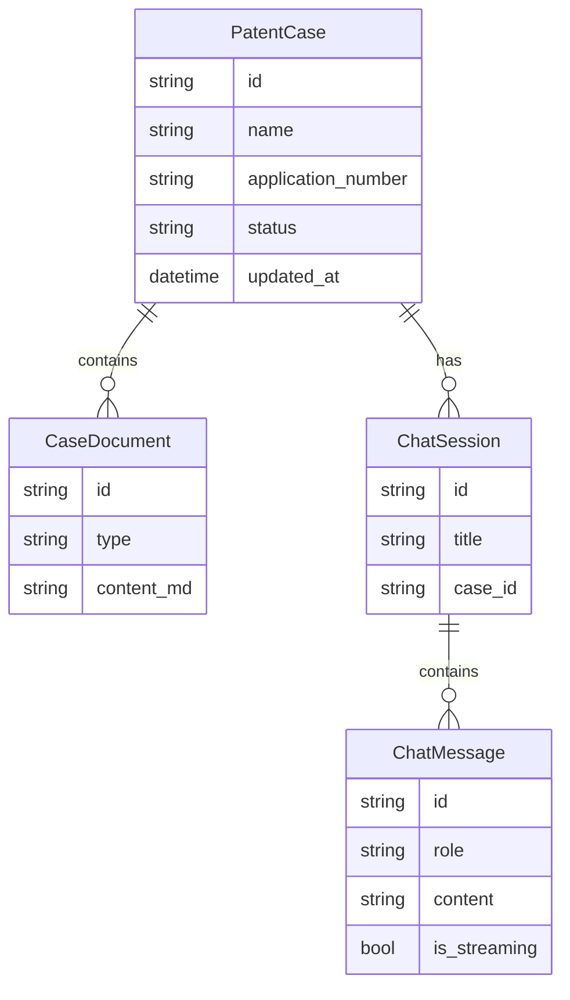
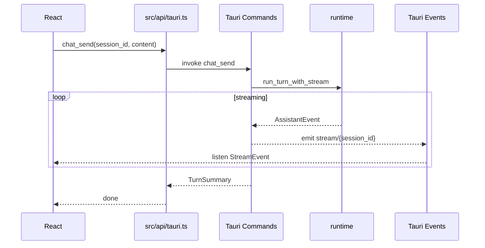

# 云熙桌面前端设计规范

**创建日期**: 2026-05-30  
**状态**: Approved for Implementation  
**版本**: v1.0  
**基线原型**: `/Users/xujian/Downloads/Kimi_Agent_配置页面缺失/app/`  
**关联文档**: [yunxi-tui-tauri-design.md](./2026-05-29-yunxi-tui-tauri-design.md)

---

## 1. 设计目标

### 1.1 目标

在 Kimi 高保真 React 原型基础上，设计 YunXi 桌面客户端（Tauri 2 + React）的完整产品与技术方案，实现：

1. 专利律师可视化工作流（撰写 / 检索 / 对比 / 审查 / 对话）
2. 与 YunXi Rust runtime 的深度集成（流式对话、工具调用、权限）
3. 可维护的前后端契约，Mock 与生产环境可切换

### 1.2 非目标（Out of Scope — MVP）

- 多用户账号与云端同步
- iOS / Android 移动端
- 独立 Web 版（HTTP Server 复用留二期）
- 实时协同编辑

### 1.3 原型基线评估

| 项 | 状态 |
|----|------|
| 三栏布局、六中心视图、Settings 七分类 | 已实现（Mock） |
| 源码路径 | `Kimi_Agent_配置页面缺失/app/` |
| 构建产物 | `Kimi_Agent_Deployment_v2/`（同源码） |
| 后端集成 | 无 |
| 设置页入口 | **缺失**（路由存在，主界面无导航） |
| Login | 存在但仅为 localStorage Mock |

---

## 2. 信息架构与用户流程

### 2.1 核心概念模型



**CaseDocument.type** 枚举：

| type | 对应视图 | 说明 |
|------|----------|------|
| `claims` | ClaimsView | 权利要求书 Markdown |
| `description` | DraftView | 说明书 |
| `drawings` | — | 附图（MVP 占位） |
| `search` | SearchView | 检索结果缓存 |
| `drafts` | DraftView | 草稿 |
| `oa` | ReviewView | 审查意见 |

**与现有 YunXi 存储对齐**：

- `ChatSession` ↔ `.yunxi/sessions/session-{id}.json`（`runtime::Session`）
- `PatentCase` ↔ 新建 `.yunxi/cases/case-{id}.json`（桌面端扩展）
- 全局配置 ↔ `.yunxi/settings.json`

### 2.2 路由

使用 **HashRouter**（原型已采用，兼容 Tauri `asset://`）。

| 路由 | 组件 | 说明 |
|------|------|------|
| `#/` | MainApp | 主工作区 |
| `#/settings` | Settings + Layout | 全屏设置 |
| `#/onboarding` | Onboarding（新建） | 替代 Login，首次 API Key 配置 |

**MVP 决策**：跳过强制 Login；若 `settings.json` 无 API Key 则 redirect 到 `#/onboarding`。

### 2.3 主界面布局

```
┌─────────────────────────────────────────────────────────────┐
│ TitleBar（macOS 交通灯 + 云熙智能体）                          │
├──────────┬──────────────────────────────┬───────────────────┤
│ Left     │ CenterPanel                  │ RightPanel        │
│ Sidebar  │ （六视图 Tab / 内容区）        │ （AI 助手对话）    │
│ 260px    │ flex-1                       │ 380px             │
│ 案件树   │ Claims/Compare/Review/...    │ Slash + 流式      │
├──────────┴──────────────────────────────┴───────────────────┤
│ StatusBar（连接 / 费用 / 模型 / 主题）                         │
└─────────────────────────────────────────────────────────────┘
```

### 2.4 视图分工

| 视图 | 用户目标 | MVP 数据来源 |
|------|----------|--------------|
| ClaimsView | 编辑/审阅权利要求 | CaseDocument + claim_parser |
| CompareView | 权利要求 vs 对比文件 Diff | patent_compare 工具 |
| ReviewView | OA 论点解析与答复策略 | examiner_simulator |
| SearchView | 多源专利检索 | patent_search + knowledge |
| DraftView | 说明书分段撰写 | patent_drafting |
| ChatView | 案件内对话 | 与 RightPanel 合并（MVP 仅 RightPanel） |

**MVP 决策**：`ChatView` 暂不独立实现；案件上下文通过 RightPanel 的 `session_id` + system prompt 注入。

### 2.5 典型工作流：审查意见答复


---

## 3. 组件改造清单（相对 Kimi 原型）

### 3.1 保留不变

- `Layout`, `TitleBar`, `StatusBar`, `ResizablePanel`, `MeshGradient`
- `CenterPanel` 及六个视图组件 UI 结构
- `Settings` 七分类及 `SettingsLayout`
- `mockData.ts` 类型定义（迁移为 `types/`）

### 3.2 必须改造

| 文件 | 改造内容 |
|------|----------|
| `LeftSidebar.tsx` | 底部增加 Settings 齿轮按钮 → `navigate('/settings')`；案件树接 `useCases()` |
| `RightPanel.tsx` | Mock 对话 → `useChat()`；Slash 命令接 `commands` API |
| `StatusBar.tsx` | Mock 费用/连接 → `get_usage` + 后端健康检查 |
| `App.tsx` | 增加 `#/onboarding`；启动时检查 settings |
| `Login.tsx` | 重命名/重构为 `Onboarding.tsx`（API Key + 模型选择） |
| 各 Center View | 从 props/mock 改为 `useCaseDocument(type)` |

### 3.3 新增组件

| 组件 | 职责 |
|------|------|
| `PermissionModal.tsx` | 工具调用 Allow / Deny / Always |
| `ToolCallCard.tsx` | 展示 tool_use + tool_result |
| `ReasoningBlock.tsx` | 可折叠 Reasoning 流 |
| `Onboarding.tsx` | 首次启动向导 |
| `providers/CaseProvider.tsx` | 案件上下文 |
| `providers/ChatProvider.tsx` | 对话 + 流式状态 |

### 3.4 新增目录结构

```
rust/crates/yunxi-cli/frontend/
├── src/
│   ├── api/
│   │   ├── index.ts          # 统一出口，环境切换
│   │   ├── types.ts          # IPC 契约 TypeScript 类型
│   │   ├── mock.ts           # 开发 Mock（复用 mockData）
│   │   └── tauri.ts          # Tauri invoke + listen
│   ├── hooks/
│   │   ├── useChat.ts
│   │   ├── useCases.ts
│   │   └── useSettings.ts
│   ├── providers/
│   ├── components/           # 自 Kimi 迁入
│   ├── pages/
│   └── types/                # 自 mockData 提取
├── package.json
└── vite.config.ts            # base: './' 已有
```

---

## 4. 数据模型

### 4.1 PatentCase（新建）

```typescript
interface PatentCase {
  id: string;
  name: string;
  applicationNumber: string;
  status: 'draft' | 'published' | 'examination' | 'rejected';
  documents: CaseDocument[];
  activeSessionId?: string;
  createdAt: string;
  updatedAt: string;
}
```

**存储路径**: `~/.yunxi/cases/case-{id}.json`

### 4.2 CaseDocument

```typescript
interface CaseDocument {
  id: string;
  type: 'claims' | 'description' | 'drawings' | 'search' | 'drafts' | 'oa';
  title: string;
  contentMd: string;
  updatedAt: string;
}
```

### 4.3 ChatMessage（UI 层）

```typescript
interface ChatMessage {
  id: string;
  role: 'user' | 'assistant' | 'system';
  content: string;
  timestamp: string;
  isStreaming?: boolean;
  blocks?: MessageBlock[];  // 扩展：tool/reasoning
}

type MessageBlock =
  | { type: 'text'; content: string }
  | { type: 'reasoning'; content: string; collapsed?: boolean }
  | { type: 'tool_use'; id: string; name: string; input: string }
  | { type: 'tool_result'; id: string; output: string; isError: boolean };
```

### 4.4 YunxiSettings（对齐现有 settings.json）

```typescript
interface YunxiSettings {
  model: string;
  modelRouter?: {
    enabled: boolean;
    strategy: string;
    threshold: number;
    fallbackModel: string;
  };
  permissions?: {
    defaultMode: 'dontAsk' | 'ask' | 'deny';
  };
  // 桌面扩展
  appearance?: {
    theme: 'light' | 'dark' | 'system';
    fontSize: number;
  };
  apiKeys?: {
    deepseek?: string;
    openai?: string;
  };
}
```

### 4.5 ViewType（原型已有）

```typescript
type ViewType = 'claims' | 'compare' | 'review' | 'search' | 'draft' | 'chat';
```

**案件子节点 → ViewType 映射**：

| child.type | ViewType |
|------------|----------|
| claims | claims |
| description / drafts | draft |
| search | search |
| drawings | — (MVP 跳过) |
| — | review（OA 文档触发） |

---

## 5. IPC 契约

### 5.1 架构



### 5.2 Commands

#### 会话与对话

| Command | 参数 | 返回 | Rust 实现 |
|---------|------|------|-----------|
| `chat_send` | `{ session_id: string, content: string, case_id?: string }` | `{ turn_id: string }` | `desktop/commands/chat.rs` |
| `chat_cancel` | `{ session_id: string }` | `()` | cancel token |
| `session_list` | — | `SessionMeta[]` | 扫描 `.yunxi/sessions/` |
| `session_load` | `{ id: string }` | `SessionJson` | `runtime::Session::load` |
| `session_save` | `{ session: SessionJson }` | `{ id: string }` | `Session::save_to_path` |
| `session_create` | `{ title: string, case_id?: string }` | `{ id: string }` | 新建 JSON |

#### 案件管理

| Command | 参数 | 返回 |
|---------|------|------|
| `case_list` | — | `PatentCase[]` |
| `case_load` | `{ id: string }` | `PatentCase` |
| `case_save` | `{ case: PatentCase }` | `{ id: string }` |
| `case_create` | `{ name: string, application_number?: string }` | `PatentCase` |
| `case_delete` | `{ id: string }` | `()` |

#### 专利工具

| Command | 参数 | 返回 | 后端 |
|---------|------|------|------|
| `patent_search` | `{ query: string, limit?: number }` | `SearchResult[]` | `tools::patent_search` |
| `knowledge_search` | `{ q: string, limit?: number }` | `KnowledgeHit[]` | `knowledge::UnifiedSearch` |
| `patent_compare` | `{ claims: string, prior_art: string[] }` | `CompareMatrix` | `patent_analysis/compare_matrix` |
| `oa_analyze` | `{ oa_text: string, claims?: string }` | `OaAnalysis` | `examiner_simulator` |
| `draft_claims` | `{ disclosure: string }` | `{ claims_md: string }` | `patent_drafting::ClaimGenerator` |
| `draft_spec_section` | `{ section: string, context: string }` | `{ content: string }` | `SpecificationDrafter` |

#### 配置与系统

| Command | 参数 | 返回 |
|---------|------|------|
| `get_settings` | — | `YunxiSettings` |
| `save_settings` | `YunxiSettings` | `()` |
| `get_usage` | — | `{ input_tokens, output_tokens, estimated_cost }` |
| `get_version` | — | `string` |
| `pick_file` | `{ filters: string[] }` | `{ path: string \| null }` |
| `export_docx` | `{ markdown: string, path: string }` | `()` |

#### 权限

| Command | 参数 | 返回 |
|---------|------|------|
| `permission_respond` | `{ request_id: string, outcome: 'allow' \| 'deny' \| 'always' }` | `()` |

### 5.3 流式 Event

**Channel**: `yunxi://stream/{session_id}`

```typescript
type StreamEvent =
  | { type: 'text_delta'; content: string }
  | { type: 'reasoning_delta'; content: string }
  | { type: 'tool_use'; id: string; name: string; input: string }
  | { type: 'tool_result'; id: string; output: string; is_error: boolean }
  | { type: 'permission_request'; request_id: string; tool: string; input: string }
  | { type: 'usage'; input_tokens: number; output_tokens: number }
  | { type: 'message_stop' }
  | { type: 'error'; message: string };
```

**Rust 映射**（`runtime::AssistantEvent` → `StreamEvent`）：

| AssistantEvent | StreamEvent |
|----------------|-------------|
| `TextDelta(s)` | `text_delta` |
| `ReasoningDelta(s)` | `reasoning_delta` |
| `ToolUse { id, name, input }` | `tool_use` |
| `Usage(u)` | `usage` |
| `MessageStop` | `message_stop` |

Tool result 由 conversation loop 产生，单独 emit `tool_result`。

### 5.4 错误码

| Code | 含义 | UI 处理 |
|------|------|---------|
| `CONFIG_MISSING` | 无 API Key | 跳转 Onboarding |
| `SESSION_NOT_FOUND` | 会话不存在 | Toast + 新建会话 |
| `TOOL_DENIED` | 用户拒绝工具 | 消息气泡显示 denied |
| `RUNTIME_ERROR` | LLM/工具失败 | 错误 Event + 可重试 |
| `IO_ERROR` | 文件读写失败 | Toast |

---

## 6. 视图-后端映射与 MVP 边界

### 6.1 映射详表

| UI | 读 | 写/动作 | YunXi 模块 | MVP |
|----|-----|---------|------------|-----|
| LeftSidebar | case_list, session_list | 新建案件/会话 | case_store + session | 是 |
| ClaimsView | case.documents[claims] | 保存 Markdown | claim_parser（校验） | 是 |
| CompareView | patent_compare | — | compare_matrix | 是 |
| ReviewView | oa_analyze | 标记论点状态 | examiner_simulator | 是 |
| SearchView | patent_search, knowledge_search | 加入对比集 | patent_search, knowledge | 是 |
| DraftView | case.documents[description] | draft_spec_section | patent_drafting | 部分 |
| RightPanel | chat_send + StreamEvent | Slash 命令 | runtime, commands | 是 |
| ModelSettings | get_settings | save_settings | llm config | 是 |
| CostSettings | get_usage | — | UsageTracker | 是 |
| PermissionModal | permission_request event | permission_respond | PermissionPrompter | 是 |
| export DOCX | — | export_docx | 二期 docx | 否 |

### 6.2 Slash 命令映射

| Slash | 前端动作 | 后端 |
|-------|----------|------|
| `/help` | 显示命令列表 | 本地 |
| `/status` | 显示 session + model | get_settings + session |
| `/cost` | 跳转 CostSettings 或 inline | get_usage |
| `/compact` | 触发压缩 | runtime compact |
| `/view [name]` | setActiveView | 本地 |
| `/search [query]` | 切 SearchView + 检索 | patent_search |
| `/analyze` | 分析当前 claims | claim_parser + oa_analyze |
| `/draft` | 切 DraftView + 生成 | patent_drafting |

### 6.3 MVP 边界

**Must Have（v0.1 桌面版）**：

- MainApp 六视图可切换（Mock → 真实数据渐进替换）
- RightPanel 流式对话 + ToolCall 展示 + 权限 Modal
- SearchView + ReviewView 接真实工具
- 设置页入口 + Model/Cost/Appearance 读写 settings.json
- 案件/会话本地持久化
- Tauri 打包 macOS dmg

**Should Have（v0.2）**：

- CompareView / ClaimsView 完整接线
- DraftView 分段撰写 + 自动保存
- 文件导入（PDF/DOCX 交底书）
- DOCX 导出

**Won't Have（MVP）**：

- 云端账号
- Web 浏览器访问
- 附图编辑器

---

## 7. Tauri 集成配置

### 7.1 目录布局

```
rust/crates/yunxi-cli/
├── frontend/                 # Kimi React 源码（自 app/ 迁入）
├── dist/                     # vite build 输出（gitignore）
├── src/desktop/
│   ├── main.rs
│   ├── commands/
│   │   ├── mod.rs
│   │   ├── chat.rs
│   │   ├── session.rs
│   │   ├── case.rs
│   │   ├── patent.rs
│   │   ├── settings.rs
│   │   └── system.rs
│   └── bridge/
│       ├── runtime_session.rs   # ConversationEngine 封装
│       └── stream_emitter.rs    # AssistantEvent → Tauri Event
└── tauri.conf.json
```

### 7.2 tauri.conf.json 变更

```json
{
  "build": {
    "frontendDist": "./dist",
    "devUrl": "http://localhost:3000",
    "beforeDevCommand": "cd frontend && npm run dev",
    "beforeBuildCommand": "cd frontend && npm run build"
  }
}
```

> 原型 Vite dev 端口为 3000（非默认 5173）。

### 7.3 开发联调

```bash
# 终端 1：前端 HMR
cd rust/crates/yunxi-cli/frontend && npm run dev

# 终端 2：Tauri 桌面
cd rust/crates/yunxi-cli && cargo run --features desktop --bin yunxi-desktop
```

### 7.4 API 层切换

```typescript
// src/api/index.ts
const useMock = import.meta.env.VITE_USE_MOCK === 'true';
export const api = useMock ? mockApi : tauriApi;
```

开发初期 `VITE_USE_MOCK=true`；IPC 就绪后切换 `false`。

---

## 8. 前端 Hooks 设计

### 8.1 useChat

```typescript
function useChat(sessionId: string) {
  // state: messages, isStreaming, pendingPermission
  // actions: send(content), cancel(), respondPermission(outcome)
  // effect: listen `yunxi://stream/${sessionId}`
}
```

### 8.2 useCases

```typescript
function useCases() {
  // state: cases, activeCase, activeView
  // actions: createCase, selectCase, saveDocument(type, content)
}
```

### 8.3 useSettings

```typescript
function useSettings() {
  // load on mount, debounced save
  // 与 AppearanceSettings 主题切换联动
}
```

---

## 9. 风险与缓解

| 风险 | 缓解 |
|------|------|
| Three.js 欢迎页性能 | 保留 `prefers-reduced-motion` 静态降级 |
| IPC 流式延迟 | 16ms batch emit；UI requestAnimationFrame 合并 |
| Session 格式演进 | version 字段 + 迁移函数 |
| 权限 defaultMode=dontAsk | 桌面端默认改为 `ask`，Settings 可配置 |
| Google Fonts CDN 离线失败 | 打包内置 Inter + JetBrains Mono |
| 双轨 TUI + GUI | runtime 零改动；共享 bridge crate 逻辑 |

---

## 10. 验收标准

### 10.1 设计阶段（本文档）

- [x] UX 流程与数据模型定义
- [x] IPC Commands + Events 契约
- [x] 视图-后端映射与 MVP 边界
- [x] 目录结构与 Tauri 配置

### 10.2 Phase 0（Tauri 验证）

- [x] `yunxi-desktop` 加载 Kimi dist，六视图可切换
- [x] MeshGradient 在 macOS WebView 流畅运行

### 10.3 Phase 1（工程迁入）

- [x] `frontend/` 编译通过，`npm run build` 输出到 `dist/`
- [x] 设置页齿轮入口可用
- [x] `VITE_USE_MOCK=true` 下功能与原型一致

### 10.4 Phase 2（IPC Bridge）

- [x] `chat_send` 流式对话可用
- [x] `get_settings` / `save_settings` 读写 `.yunxi/settings.json`
- [x] `session_list` / `session_load` / `session_save` 可用

### 10.5 Phase 3（视图接线）

- [ ] SearchView 真实检索
- [ ] ReviewView OA 分析
- [ ] RightPanel 工具调用 + PermissionModal

### 10.6 Phase 4（发布）

- [ ] `cargo test --workspace` 通过
- [x] macOS dmg 可安装运行
- [ ] 更新 [yunxi-tui-tauri-design.md](./2026-05-29-yunxi-tui-tauri-design.md) 前端选型为 React

---

## 11. 实施顺序

| 阶段 | 工期 | 产出 |
|------|------|------|
| Phase 0 | 1–2 天 | Tauri + dist 演示 |
| Phase 1 | 3–5 天 | frontend 迁入 + Mock API 层 |
| Phase 2 | 2–3 周 | IPC Bridge + 流式对话 |
| Phase 3 | 3–4 周 | 视图逐块接线 |
| Phase 4 | 1–2 周 | 打包 + CI |

**与 TUI 路线并行**：ratatui Phase 1–2 不阻塞桌面 Phase 0–1；IPC Bridge 与 TUI 的 `TurnObserver` 可共享设计模式。

---

## 附录 A：原型文件对照表

| 原型路径 | 设计后路径 | 改动 |
|----------|------------|------|
| `app/src/data/mockData.ts` | `frontend/src/types/` + `api/mock.ts` | 拆分 |
| `app/src/pages/Login.tsx` | `pages/Onboarding.tsx` | 重构 |
| `app/src/pages/MainApp.tsx` | 同路径 | 接 providers |
| `app/src/components/sidebar/LeftSidebar.tsx` | 同路径 | +Settings 入口 |
| `app/vite.config.ts` | 同路径 | 基本不变 |

## 附录 B：修订原 TUI 设计文档的条目

1. Phase 3 前端选型：**Svelte → React**（基于 Kimi 原型）
2. `frontend/` 路径：`yunxi-cli/frontend/`（非 `desktop/frontend/` Svelte）
3. 优先 IPC 而非 HTTP WebSocket 作为桌面主通道
4. HTTP Server（`yunxi server`）保留为 Web/测试用途，Phase 2 后再对齐 StreamEvent 协议
